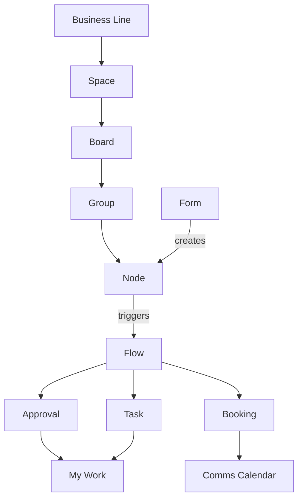

# Overview & Vision

## Purpose

This document sets the context every other document in this set builds on: why the platform exists, the problem it replaces, its goals, its five product pillars plus My Work, who uses it, the assumptions and open questions that apply platform-wide, and a map of the twelve documents that follow. It defines no mechanics of its own — those live document by document, from 01-glossary.md through 12-platform-foundation.md — and it carries almost no user stories, because there is no single persona whose story is "use the overview."

## Vision

WalaPlus runs many internal processes — a marketing campaign request, a finance payment or collection request, employee onboarding and offboarding, a communications calendar — and today every one of them is managed by hand in spreadsheets and email. The platform replaces this with flexible boards of nodes for any kind of work item, forms that create nodes, durable flows that react to a submission by generating approvals and tasks with dynamic assignees and deadlines, and a capacity-based communications calendar for booking channel slots. Every business line — an isolated part of the company — gets its own boards, people, and data, sharing nothing with any other business line on the same platform.

## The Problem

The processes above run today on Excel sheets and email threads, and that has a consistent set of costs:

- **No single source of truth.** A request's real status lives in whoever last touched the spreadsheet or the last email in a thread; two people asking "where is this" can get two different answers.
- **Deadlines computed by hand.** Someone has to remember to count business days, skip weekends and holidays, and chase the next person before a due date passes — and that memory fails under volume.
- **Approvals chased by email.** There is no queue, no reminder, and no escalation; an approval only moves when someone happens to notice it and follows up.
- **No durable record of decisions.** Who approved what, when, and why is scattered across email and chat, or not recorded at all, so audits and post-mortems start from scratch.
- **Capacity is double-booked.** Shared channels — a push notification slot, a social post — get booked in two places at once because nothing enforces capacity centrally.
- **Every process looks different.** Each team's spreadsheet has its own columns and conventions, so nothing learned running one process transfers to the next.

## Goals

- Give every recurring process a durable record, an owner, and a computed due date, so no request depends on someone's memory.
- Automate what happens after a request is submitted — approvals, task assignment, deadline math — without anyone chasing it by email.
- Keep every business line's people and data fully isolated from every other's, while all business lines run on the same shared capabilities.
- Compute deadlines the way WalaPlus actually works: the Sunday–Thursday work week and each business line's own holiday calendar.
- Give every employee one place, My Work, that shows everything currently waiting on them, so the platform is adopted through daily use rather than training.
- Retire one spreadsheet at a time, proving each phase against the process it replaces before expanding — see 11-roadmap.md.
- Keep a full record of every decision and change so a process can be audited or improved without reconstructing it from memory.

## The Platform at a Glance

Every business line organizes its work the same way: a space holds boards, a board holds groups of nodes. A form creates a node; a flow reacts to that node by generating approvals, tasks, and calendar bookings, all of which surface to the people they're waiting on through My Work.

Reading the diagram: the left-hand chain is the structural hierarchy every business line uses to organize work (see 03-boards-and-nodes.md); a form creates a node on a board within that hierarchy (see 04-forms.md); the node's creation or a later change to it can trigger a flow, whose steps generate the approvals, tasks, and channel bookings that make up the actual work of a process (see 05-flows.md); and every one of those, once created, surfaces to the person it's waiting on through My Work, or to the comms calendar for a booking (see 07-tasks-and-deadlines.md and 08-comms-calendar.md).

## Multi-Tenant Model

A business line is the platform's tenancy boundary: an isolated part of the company with its own spaces, boards, people, holiday calendar, and working language. One person holds one account and can be a member of more than one business line, but exactly one is active at a time: they switch between them deliberately, and every query, permission check, and notification is confined to whichever is active. Nothing is ever shared across the boundary: not boards, not nodes, not calendars, not audit data. Every other document in this set assumes this isolation without restating it; the full mechanics, including built-in and custom roles, are defined in 02-tenancy-and-roles.md.

## Working Language

The platform is bilingual, and it separates two kinds of text that behave differently.

**Interface text** — every button, menu, column heading, and notification the platform itself writes — exists in both Arabic and English, and each person chooses which they read. Layout direction follows that choice, so an Arabic reader gets a right-to-left interface throughout.

**Authored content** — everything a person types that others will read: field labels, help text, select options, and the names of spaces, boards, groups, custom roles, and channels — is written once, in the business line's **working language**, chosen when the business line is created. It is not translated per reader.

The consequence is deliberate: someone reading the interface in English inside an Arabic-working business line sees English chrome around Arabic field labels. A business line is expected to have one working language its people share, and the platform does not ask a Process Designer to author every label twice. Like tenancy isolation, this rule holds throughout the rest of this document set without being restated in each one.

## The Five Pillars

**Boards & Nodes** — Work lives on a board as nodes: a request, a task, a campaign, a lead, a booking, anything, all sharing the board's own field schema of the ten canonical field types. Nodes are partitioned into groups for display, and every node carries a reference number and an activity timeline. See 03-boards-and-nodes.md.

**Forms** — A form is the front door: a Process Designer builds one from the same field types, attaches it to a board, and every submission creates a node and issues a reference number like `MKT-2026-0042`. See 04-forms.md.

**Flows** — A flow is the durable automation attached to a board that reacts to a form submission, a new node, or a changed field: a mostly linear sequence of steps that can sleep for days or weeks waiting on a person or a date before continuing. See 05-flows.md.

**Approvals & Tasks** — Flow steps do the work of a process: an Approval asks someone to approve, reject, or request changes; a Task assigns work with its own due date. Both share the same four assignment rules and the same anchor ± offset deadline math. See 06-approvals.md and 07-tasks-and-deadlines.md.

**Comms Calendar** — Channels such as push, social, and pop-up offer bookable slots with declared capacity; a flow's Book Slot step places a tentative hold that an Approval confirms or releases. See 08-comms-calendar.md.

## My Work

My Work is every user's personal board: every task assigned to them and every approval waiting on their decision, across every space in their business line, sorted by due date. It is deliberately not tied to any one process — a finance approval, a marketing task, and an onboarding checklist item all land in the same list — so a person's daily question, "what do I need to do right now," has one answer regardless of how many processes they touch. My Work is the platform's primary daily screen (see 01-glossary.md and 07-tasks-and-deadlines.md) and, together with email deep links, the main way adoption is measured (see 11-roadmap.md).

## Personas

| Persona | Description |
|---|---|
| **Platform Admin** | Manages business lines, users, and global settings across the platform; does not see a business line's boards or nodes by default. See 02-tenancy-and-roles.md. |
| **Business-Line Admin** | Manages one business line: its users, custom roles, spaces, and holiday calendar; sees full audit and reporting data for that line. See 02-tenancy-and-roles.md. |
| **Process Designer** | A grantable capability, not a built-in role: designs boards, fields, forms, and flows in the spaces its holder has edit access to. See 02-tenancy-and-roles.md and 05-flows.md. |
| **Employee** | Every platform user by default: submits forms, works boards, completes tasks, and uses My Work. "Employee" describes what someone is doing in a step, not a separate role to assign. |
| **Approver** | Situational, not a fixed role: an Employee who must decide an approval, often because they are a requester's manager or hold an approving role. See 06-approvals.md. |

Beyond these five, a Business-Line Admin can create additional custom roles that bundle specific capabilities — managing the comms calendar, holding audit visibility, approving on behalf of a function — without inventing a new persona. These stay grants on top of the five personas above, not replacements for them; see 02-tenancy-and-roles.md for the full capability list.

## Assumptions

These hold for v1 unless a phase in 11-roadmap.md says otherwise:

- **Internal users only.** v1 serves employees of the company only; no external customer, vendor, or partner ever submits a form or holds an approval.
- **Sign-in with a passkey, or email and password.** A passkey is the preferred method and leaves no password to manage; email and password, with optional two-factor authentication, is the fallback. Google Workspace SSO is a later addition rather than a v1 dependency (see 02-tenancy-and-roles.md).
- **Arabic and English from day one.** Both interface languages ship together, with right-to-left layout following the reader's choice. Authored content is written once in the business line's working language (see Working Language above).
- **One account, one active business line.** A person holds a single account, may be a member of more than one business line, and works in exactly one at a time (see 02-tenancy-and-roles.md).

## Open Questions

Carried into 11-roadmap.md's "Open questions that gate later phases," which tracks how each is resolved and which phase it blocks:

- **Expected monthly request volume** — unresolved. Needed to size bottleneck and SLA-breach thresholds for the reporting in 09-notifications-and-audit.md.
- **Who holds the Process Designer role per business line** — unresolved. Needed before any business line can design its own boards, forms, and flows.
- **Which process pilots second, after finance** — partially resolved: the marketing campaign process is the assumed target, pending confirmation against Phase 1 results (see 11-roadmap.md).

## Reading Guide by Persona

The full set reads front to back for a complete picture, but a reader usually only needs the documents relevant to their own role:

| Persona | Start with |
|---|---|
| Platform Admin | 02-tenancy-and-roles.md, 12-platform-foundation.md, 11-roadmap.md |
| Business-Line Admin | 02-tenancy-and-roles.md, 07-tasks-and-deadlines.md (holiday calendar), 09-notifications-and-audit.md (reporting) |
| Process Designer | 03-boards-and-nodes.md, 04-forms.md, 05-flows.md, 06-approvals.md, 08-comms-calendar.md |
| Employee | 01-glossary.md, 07-tasks-and-deadlines.md (My Work) |
| Approver | 06-approvals.md, 09-notifications-and-audit.md (reminders and escalation) |

## Document Map

Read in order for a full picture, or jump straight to the document that owns the capability in question:

| Document | Scope |
|---|---|
| **00-overview.md** | Vision, the problem, goals, the five pillars and My Work, personas, assumptions, open questions, and this document map. |
| **01-glossary.md** | Canonical definitions of every core term, each pointing to the document that owns its full mechanics. |
| **02-tenancy-and-roles.md** | Business-line tenancy isolation, built-in and custom roles, and how role membership drives queue and audit visibility. |
| **03-boards-and-nodes.md** | The space, board, group, node hierarchy, the ten canonical field types, table view and filters, and reference numbers. |
| **04-forms.md** | How forms are built from the field types, how a published form version changes safely over time, and reference-number generation. |
| **05-flows.md** | The flow model, the seven step types, run status and lifecycle, assignment and timing inside steps, and flow versioning. |
| **06-approvals.md** | The four approval modes, the three decisions, the request-changes loop, and how approval deadlines and escalation are set. |
| **07-tasks-and-deadlines.md** | Task assignment rules and claimable queues, anchor ± offset deadline math, activation windows, and reassignment. |
| **08-comms-calendar.md** | Channels, slots, and capacity, and the booking lifecycle from tentative hold through confirmation, release, or expiry. |
| **09-notifications-and-audit.md** | In-app and email notification delivery, reminders and escalation, the append-only audit timeline, and reporting KPIs. |
| **10-example-processes.md** | Three worked processes end to end: marketing campaign request, finance payment request, and onboarding/offboarding. |
| **11-roadmap.md** | The five delivery phases, each phase's pilot and success criteria, rollout principles, and the open questions gating later phases. |
| **12-platform-foundation.md** | The tenancy, roles, auth, and language capabilities already built, and the conventions every new module follows. Read before building anything. |

## User Stories

**US-00.1** — As a Business-Line Admin evaluating the platform, I want to see the problem it replaces and the assumptions it makes for v1, so that I can judge whether my business line's own processes fit before committing to a pilot.
- Given the Vision and the Problem sections, I can compare them against a process I currently run in a spreadsheet or over email.
- Given the Assumptions section, I can identify whether my business line has a blocking constraint, such as needing Arabic before v1 ships it.

**US-00.2** — As anyone new to this document set, I want a document map naming what each document covers, so that I can go straight to the one I need instead of reading all twelve.
- Given the Document Map, I can find which single document owns a given capability, such as approvals or the comms calendar.
- Each entry names the document's filename and a one-line scope, so I know before opening it whether it's the right one.

**US-00.3** — As a Platform Admin, I want to trace each pillar to the roadmap phase that first delivers it, so that I can set the right expectations when a business line asks for a capability early.
- Given the Five Pillars, I can find the roadmap phase in 11-roadmap.md that first delivers each one.
- Given a business line asks for the comms calendar before Phase 3, I can point to that phase and its success criteria instead of guessing at a timeline.

## Out of Scope / Later

- Feature-level mechanics — how a flow step is configured, how a deadline is computed, how a slot is booked — are intentionally not repeated here; each lives in its own document.
- Resolving the open questions above is not this document's job; 11-roadmap.md tracks which phase each one gates and how it gets answered.
- A named launch date for the platform or any phase is not set here; 11-roadmap.md's phases are sequenced by success criteria, not by calendar date.
- Reporting on cycle time, bottlenecks, SLA breaches, and volumes is a pillar outcome, not a sixth pillar of its own; it is built entirely on the audit timeline described in 09-notifications-and-audit.md and delivered in Phase 5 of 11-roadmap.md.
- External or public-facing forms, and any process involving a customer, vendor, or partner as a persona, are excluded from this entire document set for v1 (see Assumptions above).
