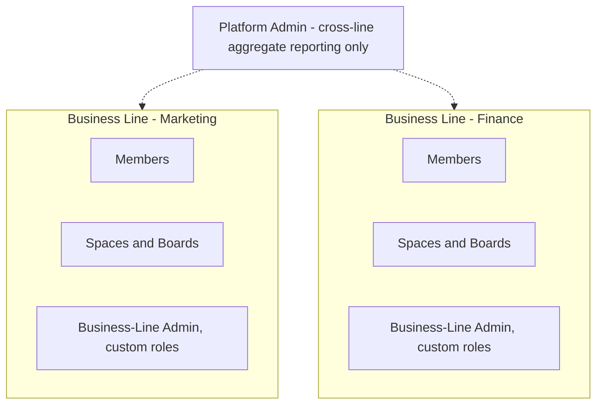
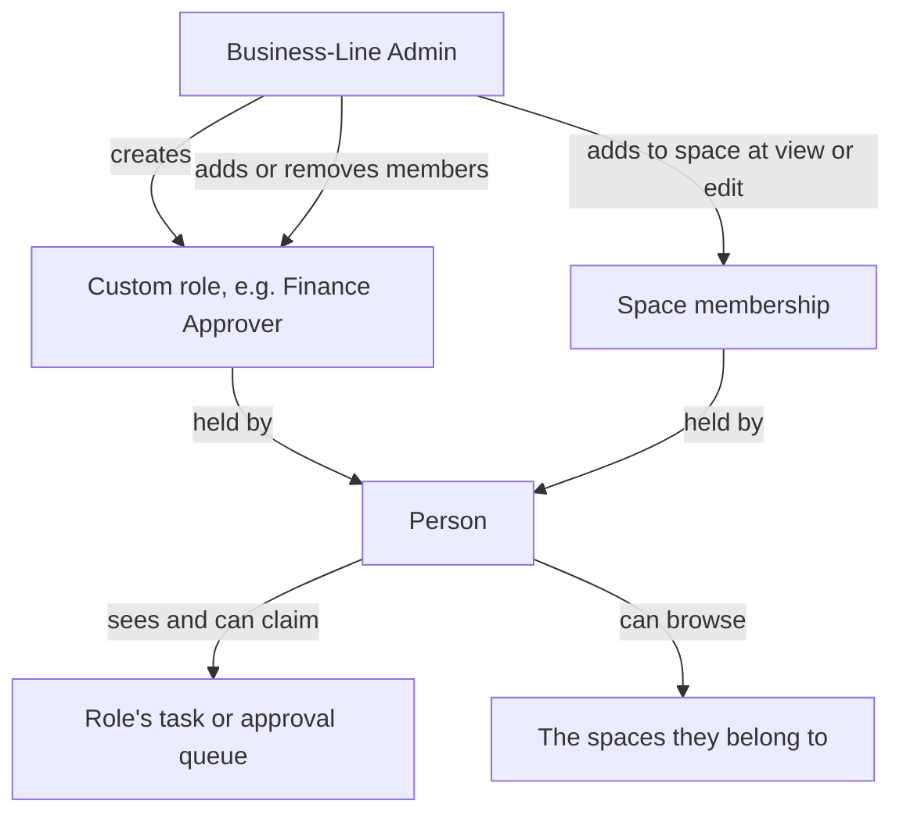

# Business Lines, Users & Roles

## Purpose

The platform serves every part of WalaPlus from one shared platform while keeping each part's people, work, and data completely separate from every other part's. This document defines the **business line** as the platform's tenancy boundary (business rule 1), how a person signs in and how one account can serve more than one business line, the **working language** each business line authors its content in, the two built-in roles every business line starts with, how a Business-Line Admin designs **custom roles** to match how their business line actually works (business rule 2), and how **space membership** — a separate mechanism from roles — decides which spaces a person can see and edit. Role membership drives who sees what everywhere else in these documents: role/team queues in 07-tasks-and-deadlines.md, approval assignment in 06-approvals.md, and audit/report visibility in 09-notifications-and-audit.md. See 12-platform-foundation.md for how each of these is already implemented.

## Business Lines and Tenancy Isolation (rule 1)

- A **business line** is a distinct part of the organization — Marketing, Finance, HR, and so on — with its own spaces, boards, processes, holiday calendar (07-tasks-and-deadlines.md), working language, and role membership.
- Nothing is shared across business lines: users' work, spaces, boards, nodes, forms, flows, calendars, notifications, and audit or report data from one business line are never visible from another.
- Isolation is enforced on every read and every write, not by convention. A record always belongs to exactly one business line, and a query that forgets to say which one returns nothing rather than everything (see 12-platform-foundation.md).
- A business line holds one or more **spaces**, its container for a related set of boards (e.g., a Marketing business line might hold a "Campaigns" space and a separate "Events" space).
- The one deliberate exception to isolation is the Platform Admin's cross-business-line reporting, described below; it surfaces aggregate figures only, never a window into a business line's boards, nodes, or audit timelines.

## User Accounts and Sign-In

- A person holds **one account**. That account can be a member of more than one business line, but exactly one business line is **active** at a time.
- Switching business lines is a deliberate act. While a business line is active, everything the person sees — boards, My Work, notifications, reports — and every permission they hold belongs to that business line and no other. Their roles in one business line grant them nothing in another.
- Sign-in uses a **passkey** where the person has registered one, and email and password otherwise, with optional two-factor authentication. A passkey leaves no password to manage, which was the original reason for preferring company Google accounts; Google Workspace SSO can be enabled later as an additional method without changing anything else in this document (see 12-platform-foundation.md).
- A Business-Line Admin invites a person by their company email address. If that person has no account yet, accepting the invitation creates one and adds them to that business line. If they already have an account — because another business line invited them first — accepting adds that business line to the account they already have.
- Every membership starts with the same baseline: the ability to submit forms, complete tasks assigned to them, and see their own My Work, before any custom role is granted or any space membership is added.
- Removing a person from a business line removes their access to it entirely, including any role membership and space membership. Their account and their membership of other business lines are untouched.
- The platform assumes internal users only in v1: every account belongs to a WalaPlus employee, and no external customer, vendor, or partner ever signs in.

## Working Language

Each business line is created with a **working language**, Arabic or English. It fixes the language of everything people in that business line type for others to read: field labels, help text, select options, and the names of spaces, boards, groups, custom roles, and channels.

The working language is separate from the **interface language**, which every person chooses for themselves and which flips the layout direction with it. Someone reading the interface in English inside an Arabic-working business line gets English buttons, menus, and notifications around Arabic field labels — the platform never asks a Process Designer to author the same label twice.

Because the working language shapes every board and form built afterwards, it is chosen when the business line is created and is not expected to change. Changing it later does not retranslate content already authored.

## Managers and Reporting Lines

Each membership can name one **manager**, who must be a member of the same business line. It is optional: a person may have none, and a business line can run without naming any at all.

It belongs to the membership rather than the person, because someone who belongs to two business lines usually reports to different people in each — and a manager resolved from the person alone could be someone outside the business line the work belongs to, which the isolation rule forbids. Nobody can be their own manager, and reporting lines cannot form a loop.

A Business-Line Admin sets and changes managers alongside the rest of a person's membership.

Being someone's manager grants exactly two things:

- **Assigning them work.** A manager can create a task for a direct report (07-tasks-and-deadlines.md).
- **Deciding their approvals.** A flow step assigned to "the requester's manager" resolves to them (06-approvals.md).

It grants nothing else — not reading everything a report does, not their My Work, not their audit timelines. A general "managers see everything below them" rule would become a second permission system running alongside roles and quietly overriding them, so authorization asks whether someone holds the capability **or** is the relevant manager, decided case by case, rather than treating the reporting line as a role.

Because it is optional, a flow can reach an approval step with no manager to assign it to. The run does not skip the step and does not fail silently: it pauses and notifies the Business-Line Admin to assign someone. A visible stall is the only acceptable outcome — an approval that quietly disappears is worse than one that waits.

## Built-in Roles

Two roles are built in and exist in every business line:

| Role | Scope | What it grants |
|---|---|---|
| **Platform Admin** | Whole platform | Creates business lines and their first Business-Line Admin; sees cross-business-line aggregate reporting only (11-roadmap.md); does not see any business line's boards, nodes, or audit timelines by default (rule 1). |
| **Business-Line Admin** | One business line | Full access to that business line's spaces, boards, processes, and audit/report data; invites and removes people; creates and manages custom roles; assigns and removes role and space membership; maintains the holiday calendar (07-tasks-and-deadlines.md). |

A Platform Admin signs in to a separate administration area with a separate account, not as a member of any business line — the separation is by design, so administering the platform never becomes a way into a tenant's work (see 12-platform-foundation.md).

Neither built-in role can be deleted, and every business line has at least one Business-Line Admin at all times. A Platform Admin does not need a Business-Line Admin's permission to create a business line, but once created, a Business-Line Admin runs it independently — the Platform Admin's cross-business-line reporting (11-roadmap.md, US-11.12) never becomes a way to view or manage a business line's boards, nodes, or day-to-day work.

## Custom Roles and Capabilities (rule 2)

Beyond the two built-in roles, a Business-Line Admin can create any number of **custom roles**, each a named bundle of capabilities within their business line. A capability grants the ability to do one specific thing, for example:

- Design and publish processes — boards, fields, forms, and flows: the **Process Designer** capability, described below.
- Hold a role or team queue that tasks or approvals can be assigned to (07-tasks-and-deadlines.md, 06-approvals.md).
- Manage the communications calendar — channels and slot capacity (08-comms-calendar.md).
- View the audit timeline and KPI reports without needing personal involvement in each node — the **audit visibility** capability referenced in 09-notifications-and-audit.md.
- Approve on behalf of a function (e.g., "Finance Manager") rather than as a named individual, so a flow's Approval step can target the role instead of a person.

Roles answer **what** a person is allowed to do; space membership answers **where** they can do it. The two are granted independently, and a person needs both to act: holding Process Designer without membership of a space means there is nowhere to design, and edit access to a space without Process Designer means the boards there can be worked but not redesigned.

Custom roles are additive: a person can hold several at once, and their combined capabilities and queue memberships are the union of every role they hold. "Employee" and "Approver," as used elsewhere in these documents, describe what someone is doing in a given step, not a role that must be granted — every member already has that baseline from the moment they join.

A person can also grant nothing they do not hold themselves: a role cannot be given a capability its creator lacks, so role management never becomes a route to self-promotion.

### Example: Custom Roles in a Finance Business Line

| Role name | Capabilities |
|---|---|
| **Finance Approver** | Approve on behalf of the Finance Manager function; view audit timelines. |
| **Payments Process Designer** | Design and publish forms and flows; no approval capability. |
| **Finance Team** | Hold the payment-execution task queue; no design or approval capability. |

A single person can hold more than one of these at once — a Payments Process Designer who is also on the Finance Team queue sees both the design tools and the claimable task queue, because their capabilities are the union of both roles. Which spaces each of them acts in is decided by their space membership, not by the role.

### Granting Process Designer

Process Designer is the capability that lets someone shape processes rather than just work within them: defining a board's fields and groups (03-boards-and-nodes.md), building the forms that create nodes (04-forms.md), and composing the flows that automate what happens next (05-flows.md).

It is granted like any other capability, through a custom role. Where the holder can actually use it is decided by their space memberships: they can design in the spaces they have edit access to, and nowhere else. Someone without Process Designer can still work those same boards normally — submitting forms, completing tasks, viewing nodes — but cannot change a field schema, a form, or a flow.

Deciding who holds Process Designer per business line is called out as an open question in 00-overview.md and 11-roadmap.md — it gates how quickly a business line can move past its first pilot process.

## Space Membership and Access

Access to a space is granted by adding a person to it, not by the roles they hold. Each membership carries one access level:

| Access | What it allows |
|---|---|
| **View** | Open the space's boards, read nodes and their timelines, and follow work already assigned to them. |
| **Edit** | Everything View allows, plus creating and editing nodes, moving them between groups, and assigning people. With the Process Designer capability, also designing the space's boards, forms, and flows. |

- A Business-Line Admin adds and removes space members and sets each one's access level. Their own access to every space in their business line is implicit.
- Being assigned a task or an approval on a board makes that item visible and actionable in My Work regardless of space membership — a person is never asked to do work they cannot open. Space membership governs browsing the space, not the individual items routed to them.
- Removing someone from a space takes effect immediately for browsing, and does not reassign work they already hold.
- Space membership never crosses a business line: a space can only be joined by members of the business line that owns it.

## Setting Up a New Business Line

Getting a business line ready to run its first process follows the same sequence every time, and touches every capability described above:

1. A Platform Admin creates the business line, sets its working language, and designates its first Business-Line Admin (US-02.1).
2. The Business-Line Admin creates its spaces and boards for the process it will pilot (US-02.7, 03-boards-and-nodes.md).
3. The Business-Line Admin invites the people who will use it, by company email address (US-02.3).
4. The Business-Line Admin defines whatever custom roles the process needs and assigns them, including Process Designer for whoever will build the forms and flows (US-02.4, US-02.5, US-02.6).
5. The Business-Line Admin adds those people to the spaces they work in, at view or edit access (US-02.8), and names each person's manager where the process routes approvals to one (US-02.9).
6. The Process Designer builds the board's fields, forms, and flow, and the business line is ready to take its first submission (04-forms.md, 05-flows.md).

## Two Isolated Business Lines

Each business line's people, spaces, and roles are self-contained; the only connection between them is the Platform Admin's aggregate reporting, shown as a dotted line because it never opens either business line's boards or nodes directly. A person who is a member of both appears in each independently, holding whatever roles that business line granted them and nothing from the other.

## Roles, Spaces and Queue Visibility

- Who "holds a role" is entirely controlled by the Business-Line Admin adding or removing members from it; that membership is what makes a role's queue tasks and approvals visible (see Claimable Queues in 07-tasks-and-deadlines.md).
- Removing a person from a role immediately removes their visibility into that role's queues and any audit visibility the role granted; it does not reassign work they already claimed.
- Role membership and space membership are removed independently — taking away a role leaves the person in the space, and removing them from a space leaves the role intact.

## User Stories

**US-02.1** — As a Platform Admin, I want to create a new business line and set its working language, so that a new part of the organization gets its own fully isolated space to work in.
- Given I create a business line, it starts with no spaces, boards, or members other than the first Business-Line Admin I designate.
- I choose its working language, Arabic or English, which fixes the language its boards, forms, and fields are authored in.
- The new business line's data is isolated from every existing business line from the moment it is created (rule 1).
- Once handed off, only that business line's own Business-Line Admin manages its spaces, roles, and people going forward — I am not involved in its day-to-day administration.

**US-02.2** — As a person working across two business lines, I want one account that can act in either, so that I don't manage two sets of credentials while my data stays separate.
- Given I am a member of more than one business line, I can switch which one is active without signing out.
- Given a business line is active, every board, report, notification, and permission I see belongs to it alone; nothing from my other business line is visible or reachable.
- Given I hold a role in one business line, it grants me nothing in the other.
- Given I am removed from one business line, my access to the other is unaffected.

**US-02.3** — As a Business-Line Admin, I want to invite people into my business line by their company email address, so that they can sign in and start working without a separate password to manage.
- Given a person's company email address, when I send an invitation, they can accept it and gain a baseline membership of my business line.
- Given they have no account, accepting creates one; given they already have one, accepting adds my business line to it.
- They sign in with a passkey, or with email and password and optional two-factor authentication.
- An invited person can submit forms, complete tasks assigned to them, and see their own My Work as soon as they accept, before any role or space membership is granted.
- Removing someone from my business line removes their access to it entirely and never affects their membership of another.

**US-02.4** — As a Business-Line Admin, I want to define a custom role that grants specific capabilities, so that permissions match how my business line actually works.
- I can create a role, name it, and choose the capabilities it grants, e.g., design processes, hold a queue, manage the calendar, view audit and reports, approve on behalf of a function.
- I cannot grant a role a capability I do not hold myself.
- Built-in Platform Admin and Business-Line Admin roles always exist and cannot be deleted; custom roles are additive on top of them.
- A person holding multiple roles gets the union of all their capabilities and queue memberships.

**US-02.5** — As a Business-Line Admin, I want to assign or remove a role for a person, so that their access always matches their current responsibilities.
- I can add someone to a role at any time; their queue visibility and audit access update immediately.
- I can remove them from a role; this stops their visibility into that role's queues right away but does not reassign work they already claimed (07-tasks-and-deadlines.md).
- I can see, at any time, every role a given person holds and every person currently holding a given role.

**US-02.6** — As a Business-Line Admin, I want to grant the Process Designer capability, so that specific people can build boards, forms, and flows.
- I can grant Process Designer through a custom role; the holder can design in the spaces they have edit access to, and nowhere else (03-boards-and-nodes.md, 04-forms.md, 05-flows.md).
- Someone without Process Designer can still work those boards and their My Work as normal but cannot change a field schema, form, or flow.
- Granting or removing Process Designer takes effect immediately; it does not affect a flow already published or a run already in progress (05-flows.md, Versioning).
- Who holds Process Designer in each business line is tracked as an open question in 00-overview.md until each line assigns it.

**US-02.7** — As a Business-Line Admin, I want to create and organize the spaces in my business line, so that each team or process area has its own container for its boards.
- I can create a space and name it, in my business line's working language; it starts empty until a board is added (03-boards-and-nodes.md).
- I can rename or reorder my business line's spaces at any time.
- A new space starts with no members other than me.

**US-02.8** — As a Business-Line Admin, I want to add people to a space at view or edit access, so that each space is visible to the people who work in it and no one else.
- Given a member of my business line, I can add them to a space with view or edit access, and change or remove that access later.
- Given someone has view access, they can open the space's boards and read nodes but cannot create or change them.
- Given someone has edit access and holds Process Designer, they can also design that space's boards, forms, and flows.
- Given someone is not a member of a space, it does not appear to them at all — but a task or approval routed to them from a board in it still reaches their My Work and can be opened and completed.
- Removing someone from a space takes effect immediately and does not reassign work they already hold.

**US-02.9** — As a Business-Line Admin, I want to name a person's manager, so that approvals and tasks can be routed to whoever they report to.
- Given a member of my business line, I can set their manager to another member of the same business line, and change or clear it later.
- I cannot set someone as their own manager, or create a loop in the reporting line.
- Given a person has a manager, an Approval or Task step assigned to "the requester's manager" resolves to them (06-approvals.md, 07-tasks-and-deadlines.md).
- Given a person has no manager and a run reaches a step assigned to one, the run pauses and I am notified to assign someone, rather than the step being skipped.
- Being someone's manager lets them assign that person a task and decide their approvals; it does not reveal that person's other work.

## Out of Scope / Later

- Fine-grained, per-field permission rules within a single board are not defined here; access applies at the space and board level.
- Per-space scoping of a *role's* capabilities is not supported in v1: a role's capabilities apply across the business line, and space membership decides where they can be exercised.
- Cross-business-line roles or shared role templates are not supported in v1; each business line's roles are configured independently.
- Self-service account creation is not supported; only an invitation adds someone to a business line, consistent with the internal-users-only assumption in 00-overview.md.
- Google Workspace SSO is not part of v1 sign-in; it can be added later as an additional method (see 12-platform-foundation.md).
- Changing a business line's working language after content has been authored is not supported; existing content is not retranslated.
- Temporarily delegating a role's capabilities (e.g., while a Business-Line Admin is away) is covered under delegation in 11-roadmap.md, Phase 4.
- Deleting or archiving an entire business line is not defined here.
