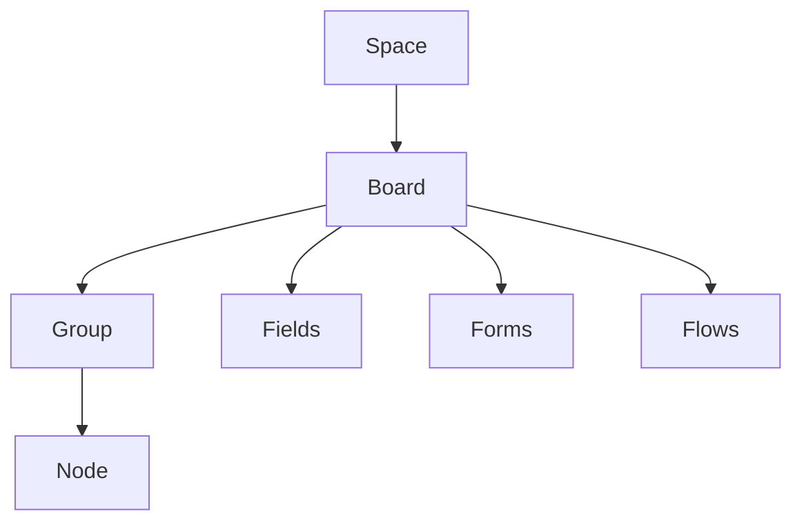

# Spaces, Boards & Nodes

## Purpose

A space is where a team's work lives, a board within it is where a single process is structured, and every request, task, and generic work item on the platform is a node on some board. This document defines the space → board → group → node hierarchy, the ten canonical field types a board is built from, the table view a board is worked from, how a node moves between groups and gets a person assigned to it, and My Work, the cross-space personal board every user starts their day on. See 02-tenancy-and-roles.md for how spaces map to business lines and roles, 04-forms.md for how a form's fields become a node's fields, 05-flows.md for how a flow turns an event on a node into a run, and 09-notifications-and-audit.md for the full mechanics of a node's activity timeline.

## The Structural Model

Work is organized in a fixed hierarchy. A board owns the field schema its nodes carry, along with the fields, forms, and flows that operate on it:

- **Space** — a container within a business line for a related set of boards, e.g. one space per team or process area. Access is granted by membership, at view or edit level, independently of the roles a person holds (see 02-tenancy-and-roles.md). Tenancy isolation applies at the business line above it, so a space is never reachable from another business line at all (business rule 1).
- **Board** — a collection of nodes sharing one field schema, defined once by a Process Designer. A board owns its fields, its groups, the forms that create nodes on it (04-forms.md), and the flows attached to it (05-flows.md).
- **Group** — a visual partition of a board's nodes, typically one group per value of a single-select or status field. Grouping is a display concern only: every node in every group on a board shares the same field schema. See 07-tasks-and-deadlines.md for how a task node's group follows the board's own layout.
- **Node** — a single work item: a request, task, or generic record. Every node carries values for the board's fields, a reference number, and an append-only activity timeline (09-notifications-and-audit.md); a node created by a form submission or a Trigger step also carries a flow run (05-flows.md).

A board's ownership of Fields, Forms, and Flows means all three travel together: the fields define what a node can hold, a form is one way of putting values into those fields to create a node, and a flow reacts to a node using those same fields. A space can hold several boards side by side — for example a Marketing space might hold both a Campaign Requests board and a separate Events board — each with its own independent field schema, groups, forms, and flows.

### Example: Groups on the Marketing Campaign Board

Groups typically mirror the stages a node's request moves through, though they remain a display concern rather than a workflow rule:

| Group | Typical nodes |
|---|---|
| New Requests | Campaign nodes just submitted, awaiting manager approval. |
| In Review | Campaigns with the marketing director's approval pending. |
| Approved | Campaigns with confirmed slot bookings and generated tasks. |
| Launched | Campaigns whose launch date has passed. |

Every node in every one of these groups still carries the same campaign name, launch date, budget, and other fields defined on the board — see 10-example-processes.md for the full campaign request walkthrough.

## Field Types (business rule 3)

Every board's field schema is built from exactly ten canonical field types — there is no custom or open-ended field type in v1:

| Field Type | Business meaning |
|---|---|
| **Text** | A short piece of identifying information, e.g. a beneficiary name. |
| **Long text** | A free-form description or explanation too long for a single line. |
| **Number** | A plain count or quantity with no currency attached. |
| **Money** | A monetary amount in a currency, e.g. a budget or payment amount. |
| **Date** | A single calendar date that other work can be paced against, e.g. a launch date. |
| **Single-select** | One choice from a fixed list, e.g. a cost center or department. |
| **Multi-select** | Any number of choices from a fixed list, e.g. platforms or channels. |
| **Person** | The platform user responsible for or associated with the node, e.g. a campaign owner. |
| **Status** | The node's current stage in its process; driven automatically by a flow run where one exists. |
| **File** | A single uploaded attachment, e.g. an invoice or creative brief. |

A Process Designer chooses which fields exist on a board and which are required; every node on that board — however it was created — carries the same set of fields. Field labels, and the option lists on select-type fields, are written once in the business line's working language, as are board, group, and space names (see 00-overview.md). See 04-forms.md for how a form maps its own fields onto these same ten types.

## Board Table View, Filters & Sorting

The default — and, in v1, the only — way to work a board is a table: nodes as rows, the board's fields as columns, partitioned into the board's groups.

- **Filters**: every column is filterable, so anyone on the board can narrow the table to, for example, only overdue nodes in one group, or only nodes where a single-select field matches a given value.
- **Sorting**: the table can be sorted by any column, for example by due date so the most urgent nodes surface first, or by reference number for chronological order.
- Filtering and sorting are display-only: they never change which group a node belongs to, what fields it carries, or its position in the underlying data — only what is currently visible and in what order.
- Filters and sorts can be combined, for example the finance team narrowing the Payment Requests board to nodes where cost center matches a given value, sorted by due date, without leaving the board.
- This table is the v1 surface for working a board; every field type described above renders as its own column, so a Money field shows an amount, a Status field shows the node's current stage, and a Person field shows the assignee's name.

## Moving Nodes Between Groups

- Anyone with edit access to a node can move it from one group to another on its board, the same way they would edit any other field.
- Where a node's group is tied to a single-select or Status field, moving it between groups updates that field's value; where the Status field is driven by a flow run, the run's progress (05-flows.md) moves the node automatically and a manual move is not expected.
- A node can only ever belong to one group on its board at a time; moving it into a new group removes it from the previous one.
- Every move is recorded on the node's activity timeline: who moved it, from which group, to which, and when (09-notifications-and-audit.md).

## Assigning People

- A board's Person field names the user responsible for a node, e.g. a campaign owner, a requester's manager, or a task's assignee.
- Anyone with edit access to a Person field can change who it names; the change is recorded on the node's activity timeline.
- For nodes generated by a flow — tasks and approvals — who gets assigned follows the four assignment rules defined in 07-tasks-and-deadlines.md and 06-approvals.md: a specific person, a role or team queue, the requester's manager, or whoever is named in a Person field on the node.
- Reassigning a node to a different person does not change its group or any of its other field values; it only changes who the Person field names.

## Node Activity Timeline

Every node carries an append-only activity timeline, visible on the node alongside its field values and current group: submissions, edits, moves between groups, reassignments, approval decisions, and booking events all appear on it in order, and nothing on it is ever edited or deleted. For example, a node's timeline might show it created by a form submission, moved from New Requests to In Review, then reassigned to a different approver — each entry with who acted and when. The full set of entry types, who can see a node's timeline, and the reporting built on top of it are defined in 09-notifications-and-audit.md.

## My Work: The Cross-Space Personal Board

My Work is every user's personal board: every task assigned to them and every approval waiting on them, gathered from every space in their business line, sorted by due date (business rule 13). It is the primary daily screen — a user opens My Work first, not a specific board, to see everything that needs their attention.

- Unlike a board a Process Designer builds, My Work is not owned by any one space; it aggregates nodes that already live on other boards across the business line.
- Overdue items sort to the top and stay flagged until resolved (07-tasks-and-deadlines.md).
- Opening an item in My Work opens the underlying node directly, with its full field values and activity timeline, exactly as it would appear from its own board.
- My Work never crosses business lines: a user with one account in one business line sees only that line's work, consistent with tenancy isolation (02-tenancy-and-roles.md).
- Items appear and disappear from My Work automatically as work is created, claimed, completed, or reassigned — no one manages My Work as a board the way a Process Designer manages a regular board.

## Reference Numbers

Every node created by a form submission carries a human-friendly reference number, assigned once and never changed or reused, e.g. `MKT-2026-0042` or `FIN-2026-0107` (see 10-example-processes.md for more examples). The prefix identifies the process — the form that created the node — not the board: a board hosting more than one form, like People Operations' Onboarding and Offboarding forms, has an independent prefix and sequence per form. See 04-forms.md for how the prefix, year, and sequence are generated (business rule 12). The reference number is what notifications (09-notifications-and-audit.md) and run lookups (05-flows.md, Finding a Run) use to identify a node.

A reference number is not what addresses a node in a link. Those use a separate short opaque code, so a URL never discloses how many records exist or in what order they were created. The two are unrelated and never substitute for each other; see 12-platform-foundation.md.

## User Stories

**US-03.1** — As a Process Designer, I want to create a board within my space and give it an initial field schema, so that it's ready to hold the nodes of a process.
- Given a space I can design in, when I create a board, I name it and add one or more fields, each one of the ten canonical types.
- The board starts with no nodes until a form, a flow, or a manual entry creates one.
- The board belongs to the space I created it in and is only visible to people with access to that space.

**US-03.2** — As a Process Designer, I want to add or remove fields on an existing board, so that its schema can evolve as the process it supports changes.
- Given a board, when I add a field, every existing and future node on the board gains that field, empty until filled in.
- When I remove a field, it disappears from the board and every node on it; the values it held are no longer shown.
- Fields referenced by an active flow or a published form cannot be removed without first updating that flow or form.

**US-03.3** — As a Process Designer, I want to define one or more groups on a board, so that its nodes are partitioned in a way that matches how the process is worked.
- Given a board, when I define a group, every node placed in it shares the board's full field schema — grouping changes nothing about which fields a node carries.
- I can add, rename, or remove groups; removing a group requires its nodes to be moved to another group first.
- I can order groups on the board, for example to lay stages out left to right in the sequence a node normally moves through.

**US-03.4** — As an Employee, I want to view a board as a filterable, sortable table of nodes partitioned into groups, so that I can find and track work items.
- Given a board, when I open it, I see its nodes as rows in a table with the board's fields as columns, partitioned into groups.
- I can filter the table by any field and sort it by any column, for example by due date.
- Filtering and sorting only change what I see; they never change a node's group, fields, or data.
- Sorting a Money or Date column orders nodes numerically or chronologically, matching the field's type.

**US-03.5** — As an Employee, I want to move a node to a different group and assign a person to it, so that its state on the board reflects who owns it and where it stands.
- Given a node I can edit, when I move it to another group, the change is applied immediately and recorded on its activity timeline.
- When I change the person named in a Person field, the previous and new values are both visible in the node's activity timeline.
- Moving a node between groups does not change any of its other field values.
- Given a node I do not have edit access to, moving or reassigning it is not offered to me.

**US-03.6** — As an Employee, I want to open My Work and see everything waiting on me across every space, sorted by due date, so that I know what to do next without visiting each board.
- Given tasks assigned to me and approvals waiting on me across multiple boards and spaces, when I open My Work, I see them all in one list, sorted by due date.
- Overdue items are flagged and sorted to the top.
- Opening any item from My Work takes me straight to its node.
- If nothing is currently assigned or waiting on me, My Work shows an empty state rather than items belonging to others.

## Out of Scope / Later

- Custom or user-defined field types beyond the ten canonical types are not supported in v1.
- Alternative board layouts — kanban, calendar, or timeline views — are not part of the v1 table surface; see 11-roadmap.md for later phases.
- Board-level automation beyond a flow attached per 05-flows.md is not covered here.
- Bulk moving or reassigning many nodes at once is not defined here; each move or assignment in v1 is a single-node action.
- Saved or shared filter and sort presets on a board are not defined here; each user's filters and sort apply to their own current view.
