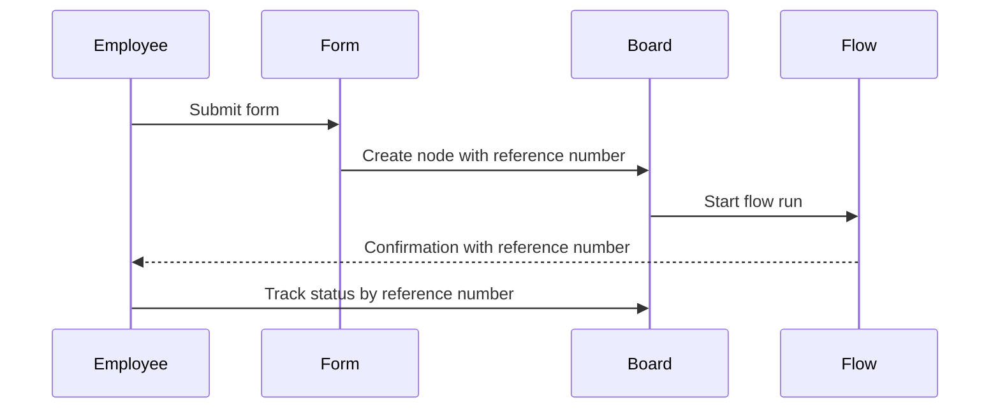
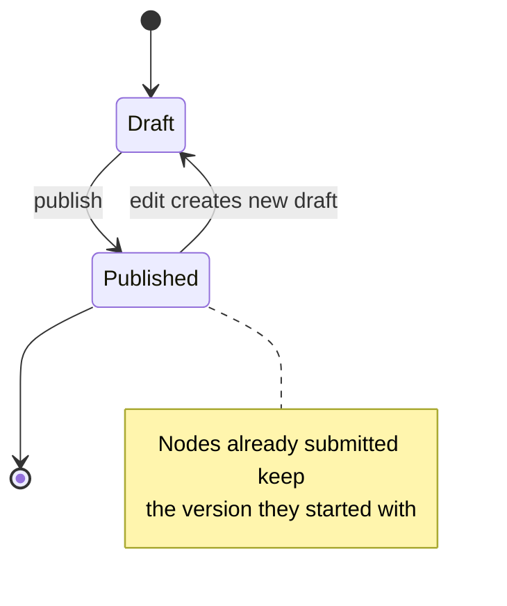

# Forms & Intake

## Purpose

A form is the front door of a process: an intake surface a Process Designer builds from the platform's ten canonical field types and maps to a single board, so that every submission creates a node carrying those values and a human-friendly reference number. Submitting a published form starts a run of the board's flow, so a request begins moving without anyone routing it by hand; an Employee can save an unfinished form as a draft, and a request sent back for changes returns to them to edit and resubmit rather than starting over. Forms are internal-only in v1 — only authenticated employees of a business line can open and submit one; there is no public or anonymous intake (see 00-overview.md). See 03-boards-and-nodes.md for the board and node model a form's fields build on, 05-flows.md for how a submission triggers a flow, 07-tasks-and-deadlines.md for the deadline math infeasible-timeline validation checks against, 06-approvals.md for the request-changes loop a resubmission re-enters, 02-tenancy-and-roles.md for who can hold the Process Designer role, and 09-notifications-and-audit.md for how the reference number appears in notifications and on the audit timeline.

## Field Types

Every field on a form is one of the same ten canonical types defined in 03-boards-and-nodes.md (business rule 3) — there is no form-only or custom field type in v1. A Status field is rarely added to a form directly, since a node created by a flow usually has its status set automatically as the run progresses (see 05-flows.md).

## Forms as Intake Surfaces

Every form is mapped to exactly one board: submitting it creates a node on that board, carrying the values entered as the node's fields (see 03-boards-and-nodes.md). A board can host more than one form — for example, the People Operations board in 10-example-processes.md uses separate Onboarding and Offboarding forms that share most of their fields but create nodes with different reference-number prefixes and start different flows.

A form's fields are drawn from its board's field schema but do not need to cover every field the board defines — a field a form leaves out can still be set later by a flow step or edited directly on the node once it exists. A board's table view (03-boards-and-nodes.md) treats a node created by a form exactly like any other node: it sits in a group, carries the same fields, and is filterable the same way, regardless of which form or flow created it.

## Building a Form

A Process Designer builds a form by adding fields from the ten types above in the order they should appear, marking each required or optional, and optionally attaching help text — a short line of guidance shown beneath the field, e.g. "Enter the amount including VAT." A required field blocks submission until it is filled in; an optional field can be left blank. Select-type fields also need their list of options defined. Labels, help text, and option lists are all written once, in the business line's working language (see 00-overview.md). Building or editing a form requires the Process Designer capability, granted through a custom role by a Business-Line Admin, plus edit access to the space the board lives in (see 02-tenancy-and-roles.md); anyone without both can still submit the form but cannot change its fields.

A form on its own does nothing beyond creating a node; what happens next is defined by a flow whose trigger is set to that form's submission (see 05-flows.md). A form that has never been published cannot be submitted; only a published version is available to requesters (see Versioning below).

## Access

Only authenticated employees of the business line that owns the board can open and submit a form; v1 has no public link, anonymous submission, or external requester (see 00-overview.md, Assumptions). A person who needs to submit into a business line they don't belong to needs an account in that line, per the tenancy rules in 02-tenancy-and-roles.md.

## Submitting a Form

When an Employee submits a published form, the platform creates a node on the mapped board carrying the entered values, assigns it a reference number (business rule 12, see below), and starts a run of the board's flow whose trigger is set to that form (see 05-flows.md). The Employee sees an immediate confirmation naming the reference number; everything from there — approvals, tasks, notifications — happens inside the triggered run, and the Employee can return at any time to check progress by that reference number.

### Reference Numbers (business rule 12)

Every form is configured with a short prefix representing the process it starts — MKT for a marketing campaign request, FIN for a finance payment request, ONB and OFF for onboarding and offboarding. On submission, the platform assigns the resulting node a reference number combining that prefix, the current year, and a running sequence number, zero-padded to four digits: `MKT-2026-0042`, `FIN-2026-0107`.

The sequence increments per process per year — each process's count is independent of every other process, and each new year starts the count back at `0001`. Once assigned, a reference number never changes and is never reused.

The reference number is shown on the node itself and included in every notification about it (see 09-notifications-and-audit.md), and it is the fastest way to find a specific run without searching a board (see 05-flows.md, Finding a Run).

## Validation and Infeasible Timelines (business rule 10)

Before a node is created, the platform checks whether the dates entered can actually support the deadlines a flow would compute from them — for example, a launch date only five days out cannot support a task that needs ten business days of lead time (see 07-tasks-and-deadlines.md, Deadline Rules). If a computed deadline would be impossible, submission is blocked, or the requester is shown a loud warning before they can proceed, depending on how the form is configured. This check runs at the moment of submission, not while a field is being typed, since it depends on the full set of dates entered and the flow's deadline offsets together.

## Draft Submissions

An Employee can save a partially completed form as a draft instead of submitting it right away. A draft holds the values entered so far but creates no node, no reference number, and no flow run — nothing exists on the board until the Employee comes back and submits it. A draft is private to the person who started it; only they can resume, edit, and submit it.

## Resubmission After Request Changes

When an Approval step returns a request-changes decision, the node reopens for its submitter carrying the reviewer's comment describing what needs to change (see 06-approvals.md, The Request-Changes Loop). The Employee edits the same form's fields on that node and resubmits; resubmitting does not create a new node or a new reference number — the existing node continues under its original reference number, and the run resumes at the same Approval step it was waiting at. This loop can repeat as many times as needed; every round is its own entry on the node's audit timeline (see 09-notifications-and-audit.md).

## Versioning (business rule 4)

Editing a published form creates a new draft version; the currently published version keeps accepting submissions unaffected while the draft is edited. Publishing the draft freezes it and makes it the version new submissions use from then on.

A node already created by an earlier submission keeps the field set and values of the form version it was submitted under — publishing a new version never changes a node that already exists, and the flow run that submission started keeps completing on the form version (and flow version, see 05-flows.md) it started with, even if newer versions are published while it is still in progress. Which version a node's run used is recorded on its audit timeline (see 09-notifications-and-audit.md).

## User Stories

**US-04.1** — As a Process Designer, I want to build a form by choosing fields from the ten field types, marking each required or optional, and adding help text, so that a board collects exactly the information a process needs and requesters understand what to enter.
- Given a board, when I add a field to its form, I can choose one of the ten field types, give it a label, mark it required or optional, and add optional help text shown to the requester.
- Select-type fields let me define their list of options.
- The form is saved as a draft and does not accept submissions until it is published.

**US-04.2** — As a Process Designer, I want to publish a new version of a form, so that I can improve it without disrupting requests already submitted.
- Given a published form, when I edit it, a new draft version is created automatically.
- Publishing the draft makes it the version new submissions use.
- A node created by an earlier submission keeps the field set and values of the version it was submitted under.

**US-04.3** — As a Process Designer, I want each form submission to get a human-friendly reference number combining a per-process prefix, the year, and a running sequence, so that requests can be referenced unambiguously.
- Given a form, when I configure it, I can set the prefix used for its process, e.g. MKT or FIN.
- Given a submission, when the node is created, its reference number combines the prefix, the current year, and the next sequence number for that process and year, e.g. MKT-2026-0042.
- The reference number is shown on the node and included in every notification about it.

**US-04.4** — As an Employee, I want to submit a form and immediately see my reference number, so that I know my request was received and how to find it later.
- Given all required fields are completed, when I submit, a node is created on the form's board and a reference number is issued.
- I see a confirmation naming the reference number as soon as I submit.
- My submission starts the board's flow, and I can see the run's progress from the node itself (see 05-flows.md).
- The submission is recorded as the first entry on the node's audit timeline (see 09-notifications-and-audit.md).

**US-04.5** — As an Employee, I want the platform to stop or warn me when my dates can't support the deadlines a request needs, so that I don't submit a request that is impossible to deliver on time.
- Given the dates I entered would make a computed deadline fall before submission, when I try to submit, I am blocked or shown a clear warning before the node is created.
- The warning or block explains which deadline is impossible and why.
- If the form allows warnings rather than a hard block, I can still choose to submit after acknowledging it.
- The check is based on the same anchors and offsets a Process Designer configured on the flow's steps (see 07-tasks-and-deadlines.md, Deadline Rules).

**US-04.6** — As an Employee, I want to save a partly filled form as a draft, so that I can finish it later without losing my progress.
- Given a form I've started, when I save it as a draft, my entered values are kept but no node or reference number is created yet.
- Only I can see and resume my own draft.
- Submitting the draft later creates the node and reference number as a normal submission.
- A draft never triggers the board's flow, since no node exists yet for the flow to act on.

**US-04.7** — As an Employee, I want to find my request by its reference number, so that I don't have to search the board to check on it.
- Given a reference number, when I look it up, I am taken straight to the node it identifies.
- The node shows my originally submitted values and the current status of its flow run.
- This works the same whether the request is still in progress or already completed.

**US-04.8** — As an Employee, I want to edit and resubmit a request after a reviewer asks for changes, so that my request can continue without starting over.
- Given my node receives a request-changes decision, I can reopen it and see the reviewer's comment describing what to change.
- I edit the relevant fields on the same form and resubmit.
- Resubmitting keeps the same reference number and returns the run to the approval step it was waiting at (see 06-approvals.md).
- Each round of edit-and-resubmit is recorded as its own entry on the node's audit timeline, so the full back-and-forth stays visible (see 09-notifications-and-audit.md).

## Out of Scope / Later

- Conditional field visibility (showing or hiding a field based on another field's value) is not available in v1; every field on a published form version is always shown.
- Multi-page or multi-step forms are not supported; a form is a single page of fields.
- Custom validation beyond required/optional (e.g., regex patterns, min/max ranges) is not part of v1.
- Cloning an existing form as the starting point for a new one is not available in v1.
- Public or external-facing forms are not supported in v1; only authenticated employees of the business line can submit, per the internal-users assumption in 00-overview.md.
- Auto-saving a draft at fixed intervals is not defined; saving a draft is an explicit action by the Employee.
- Per-reader translation of a form is not supported: labels, help text, and options are authored once in the business line's working language, not once per language (see 02-tenancy-and-roles.md). The interface around the form still follows each reader's own language choice.
- Keeping more than one draft per form per Employee at a time is not supported; starting a new draft replaces any unsubmitted one.
