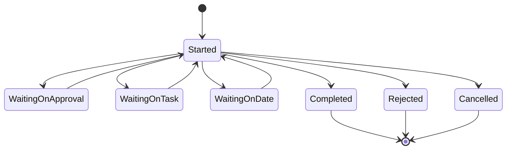
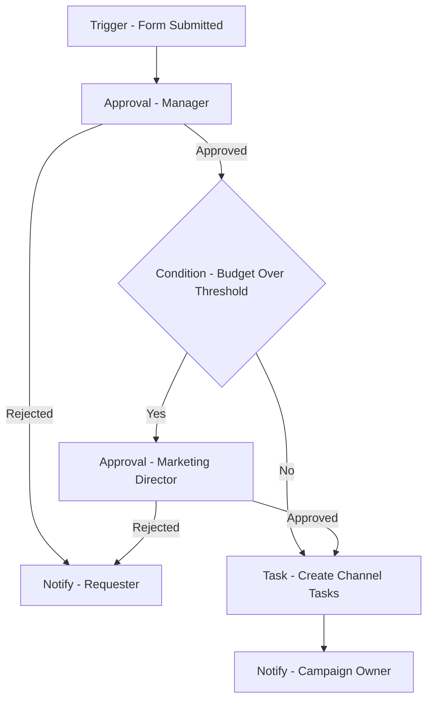

# Flows

## Purpose

A flow is how the platform automates what happens after a form is submitted or a node changes: a durable, mostly linear sequence of steps — approvals, tasks, waits, notifications, and slot bookings — attached to a board, so requests move forward without anyone chasing them by email. This document describes the flow model, the step types available to a Process Designer, how a run behaves while it is in progress, and how a published flow can change over time without disturbing work already underway. Approval mechanics live in 06-approvals.md, task assignment and deadlines in 07-tasks-and-deadlines.md, slot booking in 08-comms-calendar.md, and notification delivery in 09-notifications-and-audit.md.

## The Flow Model

Each board can have one or more flows. A flow has exactly one trigger and a sequence of steps that follow it. The sequence is mostly linear: steps run one after another, and a Condition step can split it into branches based on values on the node. There is no free-form canvas in v1 — a Process Designer builds a single path with optional branches rather than drawing arbitrary connections between steps, and every branch continues toward an end.

A flow is attached to a board, not to a single node. Every node that matches the trigger — a submitted form, a node created on the board, or a changed field — starts its own independent run of that flow. A board can hold several flows at once, for example one flow for new requests and a separate, simpler flow that reacts whenever a particular field changes on an existing node.

Composing a flow is deliberately simple: the Process Designer picks a trigger, then builds the step sequence by adding steps one at a time and configuring each — who approves, who is assigned, what the wait is for, who gets notified, or which channel a slot is booked on. Steps can be reordered, and a Condition step can be inserted at any point to split the remaining sequence into branches.

## Step Types

| Step | What it does |
|---|---|
| **Trigger** | Starts a run: a form is submitted, a node is created on the board, or a chosen field on a node changes. Every flow has exactly one. |
| **Condition** | Checks values on the node and sends the run down one of two or more branches. |
| **Approval** | Asks one or more people to approve, reject, or request changes before the run continues. See 06-approvals.md. |
| **Task** | Creates a work assignment for someone, with its own due date. See 07-tasks-and-deadlines.md. |
| **Wait** | Pauses the run until a specific date, or for a set offset from an earlier point in the run, before continuing. |
| **Notify** | Sends an in-app and email notification to chosen people without waiting for a response. |
| **Book Slot** | Places a hold on a channel slot in the communications calendar. See 08-comms-calendar.md. |

A flow can use any of these steps more than once, in any order that makes sense for the process — several Task steps in a row to fan out work to different people, a Notify step after every Approval, or a Wait step before each of several date-driven reminders. A Condition step never does work itself; it only decides which branch the run takes next, based on a field on the node (for example, whether a budget field is above or below a threshold).

A few points are worth stating plainly:

- A **Trigger** fires once per matching event — one form submission, one node creation, or one field change starts exactly one run.
- A **Notify** step is fire-and-forget: it sends its notification and the run moves straight on, unlike Approval, Task, and Wait, which pause the run until something resolves.
- A **Book Slot** step places a tentative hold as soon as the run reaches it; the hold is only confirmed or released later, by an Approval elsewhere in the same run.
- Reminders before a due date and escalation on an overdue Approval happen automatically and are separate from a designed Notify step — see 09-notifications-and-audit.md.

## Assignment Inside Steps

Approval and Task steps do not need to name a specific person at design time. Each can be assigned one of four ways: to a specific person, to a role or team queue that anyone holding the role can claim, to the requester's manager, or to whoever is named in a person field on the node. The same four assignment rules apply consistently to both step types — see 06-approvals.md and 07-tasks-and-deadlines.md for how each uses them.

Whenever a run reaches an Approval or Task step, the resulting item appears in My Work for the person or queue it is assigned to, alongside everything else waiting on them across their business line.

## Timing Inside Steps

Task and Wait steps do not use a fixed calendar date chosen at design time. Instead, a due date or target date is computed from an anchor — the submission date, an approval date, a date field on the node, or the completion of an earlier step — plus or minus an offset that can count business days. See 07-tasks-and-deadlines.md for the full set of anchors and offsets, including how the platform handles a submission whose dates make a computed deadline impossible.

## Durable Runs

A run does not need to finish in one sitting. It can sit at a Wait step for weeks until a target date arrives, or at an Approval or Task step for as long as it takes the assigned person to act — a copywriting task might not be picked up for several business days, and a launch-day checklist might not be reached until a campaign's launch date arrives weeks after submission. Nothing is lost while a run is paused — when the outstanding approval is decided, the task is completed, or the date is reached, the run picks up exactly where it left off and continues to the next step. From the requester's side, this looks like nothing more than a request that quietly keeps moving until it is done.

## Run Lifecycle and Statuses

A run starts the moment its trigger fires. From there it moves through the flow's steps, pausing whenever a step needs something external:

- **Started** — the run has begun and is actively moving through steps.
- **Waiting** — the run is paused at a step that needs something external: a decision on an Approval, completion of a Task, or a date being reached at a Wait step.
- **Completed** — the run reached the end of its path.
- **Rejected** — an Approval step inside the run ended in rejection, and the run stopped there.
- **Cancelled** — the run was stopped before completion, for example because the underlying node was cancelled.

A request-changes decision on an Approval does not reject the run outright; it hands the node back to the submitter to edit and resubmit, and the run stays waiting at that Approval step until it is resubmitted. The full mechanics of decisions belong to 06-approvals.md — this document only covers what it means for the run's status.

Every node carries its run's current step and status on its activity timeline, so anyone looking at the node can see exactly where the request stands. The same status is visible from the board the node lives on — see 03-boards-and-nodes.md — and the full history of what happened is in 09-notifications-and-audit.md.

## Finding a Run

Every run belongs to a node, and every node created by a form submission carries a human-friendly reference number, such as MKT-2026-0042. Searching for or opening a node by its reference number is the fastest way to check on a specific run without hunting through a board.

## Example Flow

The flow below is a simplified version of the marketing campaign request described in 10-example-processes.md: a manager approval, a budget-based branch to a second approval, and the resulting tasks and notification.

Reading the diagram: the trigger starts the run, the manager's decision either ends the run at a rejection notice or continues it into the condition, the condition decides whether a second approval is needed, and either path finishes by creating the channel tasks and notifying the campaign owner.

The other processes in 10-example-processes.md shape the same building blocks differently. The finance payment request also branches: a manager approval is followed by a Condition on the amount threshold, which gates a second, conditional approval by the finance manager — two single-approver Approval steps joined by a Condition, not a sequential-chain approval. Onboarding uses no Approval step whatsoever — just a fan-out of Task steps, each anchored to the employee's start date, so IT, facilities, payroll, and the manager's welcome task are all created by the same trigger and simply become actionable at different points.

## Versioning

Editing a published flow creates a new draft version; the currently published version keeps working unaffected while the draft is edited. Publishing the draft freezes it and makes it the version that new triggers use from then on. A run already in progress always finishes on the version of the flow it started with, even if a newer version is published while it is still running.

In practice this means a Process Designer can safely fix a mistake or add a step to a flow at any time — nodes already moving through the old version are unaffected, and only nodes triggered after publishing pick up the change. A flow that has never been published cannot trigger a run; only a published version responds to submissions. See 01-glossary.md for the general definition of a Version, which applies the same way to forms.

## User Stories

The stories below cover a Process Designer building and evolving a flow, and an Employee watching a request they submitted move through one.

**US-05.1** — As a Process Designer, I want to compose a flow for a board by choosing a trigger and adding steps in sequence, so that submissions are handled automatically without manual follow-up.
- Given a board, when I create a flow, I can choose exactly one trigger: form submitted, node created, or field changed.
- I can add steps in order from the step types: Condition, Approval, Task, Wait, Notify, Book Slot.
- The flow is saved as a draft and does not affect live nodes until it is published.

**US-05.2** — As a Process Designer, I want to add a condition branch to a flow, so that the sequence adapts to values on the node.
- Given a flow, when I add a Condition step, I can branch on any field defined on the board.
- Each branch continues with its own sequence of steps.
- Branches always lead to an end or rejoin the flow; there is no open-ended canvas to design.

**US-05.3** — As a Process Designer, I want to publish a new version of a flow, so that improvements apply going forward without disrupting requests already underway.
- Given a published flow, when I edit it, a new draft version is created automatically.
- Publishing the draft makes it the version used by new triggers.
- Runs already in progress keep completing on the version they started with, unaffected by the new publish.

**US-05.4** — As an Employee, I want to see the progress of a request I submitted, so that I know what has happened and what is next.
- Given a node created by my submission, when I open it, I can see which step its run is on and the run's status.
- I can see which steps are complete, which step is current, and what remains.
- If the run is waiting on an Approval or a Task, I can see who it is waiting on.

**US-05.5** — As a Process Designer, I want to see all active runs of a flow I designed, so that I can spot ones that are stuck or taking too long.
- Given a flow I have published, when I open its run list, I can see every run's current step and status.
- I can find runs that have been waiting the longest.
- I can open any run to reach its node and see its full history.

## Out of Scope / Later

- Free-form canvas flow design, with arbitrary connections between steps, is not available in v1; flows stay mostly linear with branches.
- Steps running in parallel, rather than one branch at a time, is a later-phase capability — see 11-roadmap.md.
- Reusable flow templates that can be copied across boards are not part of v1.
- A flow having more than one trigger is not supported; each trigger needs its own flow.
- Manually skipping or reordering steps within a run that has already started is not possible; changes only take effect for future runs, through a new version.
- Delegating an assigned Approval or Task to someone else while its owner is away is a later capability — see 11-roadmap.md.
- Escalation chains beyond a single overdue reminder are a later capability — see 11-roadmap.md.
- Flow-level reporting such as cycle time, bottleneck steps, and SLA breaches is covered separately under the platform's reporting capability — see 09-notifications-and-audit.md (Phase 5 in 11-roadmap.md).
- Cloning an existing flow as the starting point for a new one is not available in v1; each flow is built from scratch.
