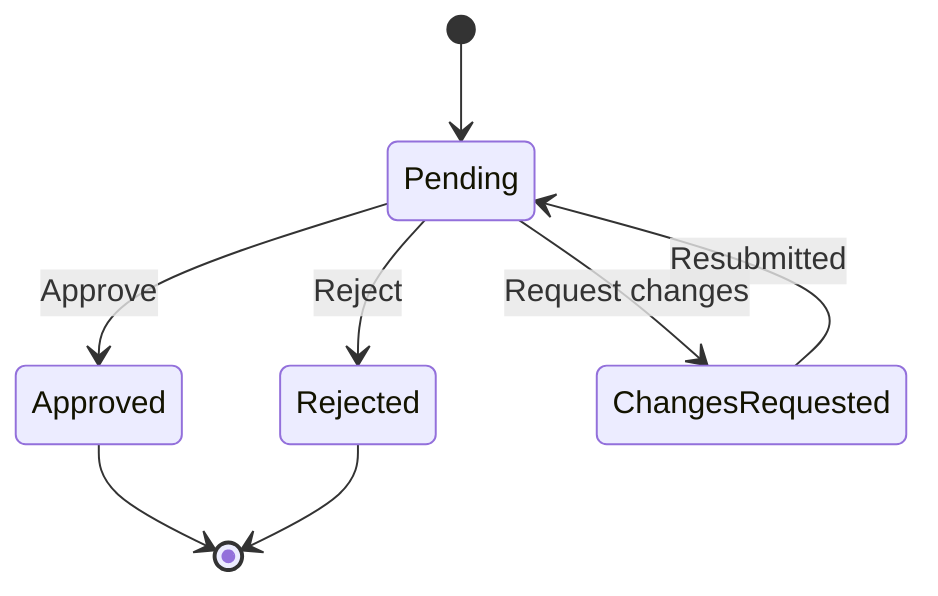
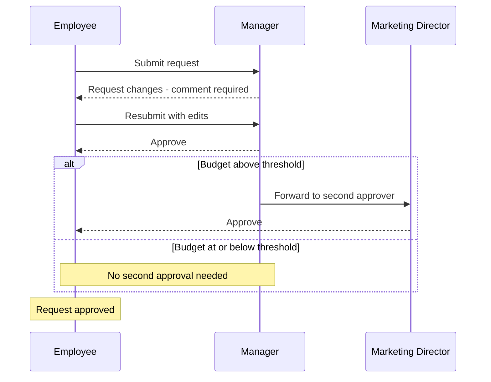

# Approvals

## Purpose

An approval is the step type that asks one or more people to make a governance decision — approve, reject, or request changes — before a flow run continues. This document defines the four approval modes a Process Designer can choose between, the three decisions an Approver can record, how a request-changes decision loops the node back to its submitter for resubmission, how approvers are chosen, how a second approver can be added conditionally on a field value such as a budget threshold, and how an approval's due date, reminders, and escalation are established (business rule 6). See 05-flows.md for how an Approval step sits inside a flow and what a decision means for the run's status, 07-tasks-and-deadlines.md for the assignment rules and anchor ± offset deadline math approvals share with tasks, and 09-notifications-and-audit.md for how reminders, escalation, and email deep links are delivered and recorded on the audit timeline.

## Approval Modes

Every Approval step uses exactly one of four modes, chosen by the Process Designer when the step is configured. Each named approver — whether a step has one or several — is assigned using the same four assignment rules as a Task step (rule 7, see Assignment below).

| Mode | Approvers | Step resolves when |
|---|---|---|
| **Single approver** | One named approver. | That approver records a decision. |
| **All of a set** | A named set of approvers, all required. | Every approver in the set has approved. A reject or request-changes from any one of them ends the step immediately with that outcome; the rest are not made to decide on a request that has already failed. |
| **Any of a set** | A named set of approvers, any one sufficient. | The first approver in the set to approve resolves the step as approved. The step only ends in rejection or request-changes once every approver in the set has decided against it. |
| **Sequential chain** | An ordered list of approvers. | Each approver decides only after the one before them has approved. A reject or request-changes anywhere in the chain ends the step immediately with that outcome; approvers later in the chain are never asked. |

A sequential chain is one Approval step with several approvers deciding in turn — it is different from chaining two separate Approval steps together with a Condition step in between, which is how a threshold-based second approver is added (see Conditional Approvers, below). Use a sequential chain when the same fixed group must always weigh in, in a fixed order; use two single-approver steps joined by a Condition when whether the second approval happens at all depends on a value on the node.

## Decisions

Whatever mode a step uses, every individual approver records one of exactly three decisions:

- **Approve** — moves the step toward resolving as described above. A comment is optional.
- **Reject** — requires a mandatory comment explaining why. If the decision resolves the step, the run's status becomes Rejected and stops there (see 05-flows.md, Run Lifecycle and Statuses).
- **Request changes** — requires a mandatory comment describing what needs to change. If the decision resolves the step, the node is handed back to its submitter to edit and resubmit; the run stays Waiting at the same Approval step rather than ending.

Every decision is recorded permanently on the node's audit timeline with the decision-maker, timestamp, and comment (rule 14, see 09-notifications-and-audit.md). A recorded decision cannot be edited or withdrawn.

## The Request-Changes Loop

A request-changes decision does not reject the run; it returns control to the submitter:

1. The node reopens for editing by its submitter, carrying the reviewer's comment describing what needs to change.
2. The submitter edits the node and resubmits it.
3. The Approval step restarts on the same mode: for Single approver and Any of a set, the same approver(s) decide again on the resubmitted node; for All of a set and Sequential chain, every approver decides again, since the change may affect people who had already signed off.
4. The run stays Waiting at that Approval step the whole time — it never leaves the step, and it is never marked Rejected for a request-changes decision.

This loop can repeat as many times as needed; each round of edit-and-resubmit is its own entry on the audit timeline, so the full back-and-forth stays visible (see 09-notifications-and-audit.md).

## Assignment

Every approver — the one person in Single approver, every slot in All of a set or Any of a set, each link in a Sequential chain — is assigned using exactly one of four rules (rule 7), the same rules a Task step uses (see 07-tasks-and-deadlines.md, Assignment Rules):

1. **A specific user** — named directly on the step.
2. **A role or team queue** — any eligible holder can see and claim the approval; the first to claim becomes its sole approver.
3. **The requester's manager** — resolved automatically from who submitted the triggering form.
4. **The person named in a field on the node** — a person-type field filled in by the requester or an earlier step.

A role-or-team-queue approver behaves the same as a queue task: it stays visible to every eligible holder until one of them claims it, and claiming is recorded on the node's activity timeline.

## Conditional Approvers

Not every additional approver belongs inside the same mode. Many processes only need a second decision when a field value crosses a threshold — a campaign's budget, a payment's amount — and that is designed as a second, separate Approval step gated by a Condition step in the flow, not as a larger set inside the first step (see 05-flows.md, Step Types).

- The Process Designer places a Condition step immediately after the first Approval step, branching on a field defined on the board — for example, a money field compared against a threshold.
- When the condition is true, the run proceeds into a second Approval step with its own mode and its own assignee, chosen independently of the first.
- When the condition is false, the run skips the second Approval step entirely and continues straight to whatever step follows.
- From the requester's point of view the two approvals still read as one continuous chain: a reject or request-changes decision at either step behaves exactly as described under Decisions, above, and My Work shows only whichever approval is currently pending.

Examples: 10-example-processes.md routes a marketing campaign to the marketing director only when budget exceeds the campaign spend threshold, and a finance payment to the finance manager only when the amount exceeds the payment approval threshold. Both are two single-approver Approval steps joined by one Condition step, not a fifth mode.

## Deadlines, Reminders & Escalation

An approval's due date is computed the same way a task's is — anchor ± offset, in calendar or business days (see 07-tasks-and-deadlines.md, Deadline Rules). A reminder goes out to the pending approver a configurable interval before the due date; an approval that passes its due date without a decision escalates, notifying the approver again and alerting an escalation contact so the request does not stall silently. Delivery, cadence, and the escalation contact for each mode are defined in 09-notifications-and-audit.md.

## Deciding from My Work or Email

An approver reaches a pending decision from two equivalent entry points:

- **My Work** — every approval assigned to the approver, or claimable from a role queue, appears sorted by due date alongside their tasks (rule 13, see 01-glossary.md).
- **Email deep link** — the notification sent when the approval becomes actionable links straight to the same decision screen, so an approver working from their inbox never has to search for the request first (rule 15, see 09-notifications-and-audit.md).

Both paths open the identical decision screen: the node's details, any prior comments on the same approval, and the three decision options. Whichever entry point an approver uses, the recorded decision is the same and appears on the audit timeline immediately.

## Decision States

Whatever mode or number of approvers a step uses, a single approval always sits in one of these states from the moment it is created to the moment it resolves.

## Example: Manager Approval with a Conditional Second Approver

The sequence below walks a single request through a request-changes round, a manager's approval, and a conditional second approval gated by a budget threshold — the same shape as the marketing campaign request in 10-example-processes.md.

## User Stories

**US-06.1** — As a Process Designer, I want to choose an approval's mode — single approver, all of a set, any of a set, or sequential chain — so that the decision matches the process's governance.
- Given I'm configuring an Approval step, I can choose exactly one of the four modes.
- For all of a set, any of a set, or sequential chain, I name more than one approver, each assigned using the same four assignment rules as a Task (see 07-tasks-and-deadlines.md).
- For sequential chain, I also set the order the named approvers decide in.

**US-06.2** — As an Approver, I want to approve, reject with a mandatory comment, or request changes (returning the node to the submitter to edit and resubmit), so that decisions are recorded permanently and the requester knows the next step.
- Given an approval assigned to me, when I open it from My Work or an email deep link, I reach the approval's decision screen showing the node's details and any prior comments on the same approval.
- Rejecting or requesting changes requires me to enter a comment before I can submit the decision.
- My decision is recorded on the node's audit timeline with my name, the timestamp, and my comment.
- Deciding from My Work or from the email deep link reaches the same decision screen and records the same outcome either way.

**US-06.3** — As an Employee, I want to see my request's current approval step and who it's waiting on, so that I always know where my request stands.
- Given my submitted node is waiting on an approval, I can see the current step and who it is waiting on from My Work or the node itself (see 05-flows.md).
- Given my submitted node receives a request-changes decision, my request's run stays visible as Waiting in My Work throughout that round, never Rejected.
- The edit-and-resubmit mechanics themselves — reopening the node, editing fields, resubmitting under the same reference number — are covered in 04-forms.md, US-04.8.

**US-06.4** — As a Process Designer, I want an any-of-a-set approval to resolve as soon as one approver in the set decides, so that a broad review group doesn't slow a request down waiting on the slowest person.
- Given an any-of-a-set approval with multiple eligible approvers, the step resolves approved the moment any one of them approves.
- If every approver in the set rejects or requests changes without any approval, the step resolves with that outcome.
- Approvers who haven't yet decided when the step resolves are not required to act on it afterward.

**US-06.5** — As a Process Designer, I want to add a conditional second approver based on a field value threshold, so that only higher-risk requests get the extra review.
- Given a flow with a first Approval step, I can insert a Condition step after it that branches on a field defined on the board, such as a money field compared against a threshold.
- On the branch where the condition is true, I add a second Approval step with its own mode and assignee, independent of the first.
- On the branch where the condition is false, the run continues directly to the next step without creating a second approval.
- Given a decision on the second Approval step, it follows the same three-decision rule and the same permanent audit recording as any other approval (see Decisions, above).

## Out of Scope / Later

- Weighted or percentage-based approval thresholds (e.g., 3 of 5 must approve) are not a fifth mode; only the four modes above are available in v1.
- Delegating an approval to someone else while its assigned approver is away is a later capability — see 11-roadmap.md, Phase 4.
- Multi-level escalation chains beyond the single configured escalation contact are a later capability — see 05-flows.md and 11-roadmap.md.
- Editing or withdrawing a decision after it has been recorded is not supported; a changed outcome requires the run to reach a new Approval step or a fresh submission.
- Conditional approvers are limited to a single threshold check per branch point in v1; nesting multiple Condition steps to layer several thresholds is possible but not a dedicated feature of the Approval step itself — see 05-flows.md.
