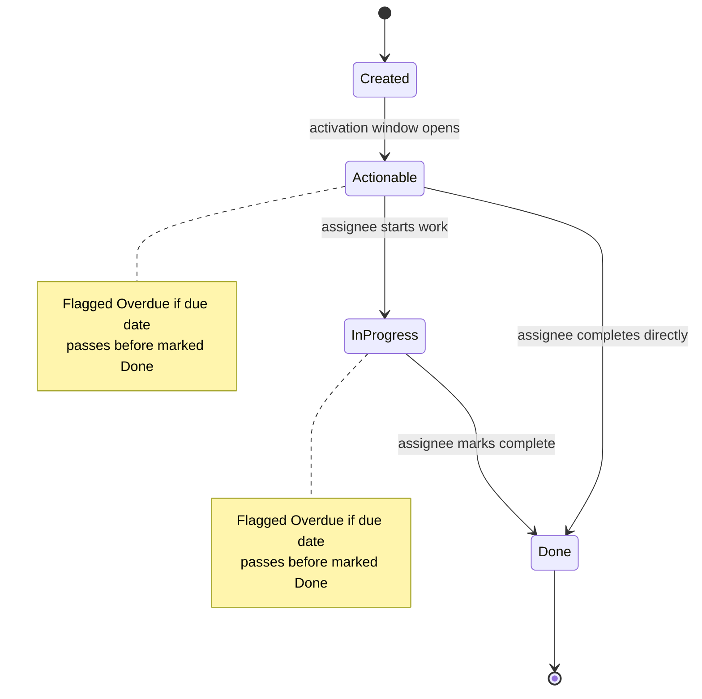
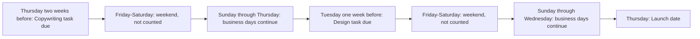

# Tasks, Assignment & Deadlines

## Purpose

A task is a work assignment created by a flow step: it appears as a node on its board and simultaneously in the assignee's My Work, so the person responsible sees it in one place regardless of which board it came from. This document defines how tasks get an assignee, how their due dates are computed, when they surface to the assignee, and how overdue work and reassignment are handled. See 05-flows.md for how a Task step is defined within a flow, and 06-approvals.md for the parallel human-decision path, which shares the same assignment and deadline rules.

## Tasks as Nodes and in My Work

- When a flow run reaches a Task step, the platform creates a task: a node on the board, carrying whatever fields the step defines (title, description, due date, assignee).
- The same task also appears in the assignee's My Work, sorted by due date alongside every other task and approval waiting on that person, across all their spaces (rule 13, see 01-glossary.md for My Work).
- A single run can generate several tasks, each with its own assignee and deadline computed independently.
- Completing a task lets its flow run proceed to the next step; see 05-flows.md for how step completion advances a run.
- A task node carries the same field types as any other node (see 03-boards-and-nodes.md): a title, an optional description, a due date, and an assignee field, plus any custom fields the Process Designer added to that board.
- Where a task lands on its board — which group it appears in — follows the board's own layout, the same way any node created by a form or a flow does.

## Assignment Rules

Every task (and every approval, see 06-approvals.md) is assigned using exactly one of four rules, chosen by the Process Designer when the step is configured:

1. **A specific user** — the step names an exact person.
2. **A role or team queue** — anyone holding the named role can see and claim the task; see "Claimable Queues" below.
3. **The requester's manager** — resolved automatically from the person who submitted the triggering form.
4. **The person named in a field on the node** — the step points at a person-type field (filled in by the requester or an earlier step), and the task goes to whoever is named there.

### Claimable Queues

- An unclaimed queue task is visible to every user holding the target role in the business line.
- Any eligible holder can claim it; the first to claim becomes the sole assignee, and the task disappears from every other holder's queue.
- Claiming is recorded on the node's activity timeline (who claimed it, when); see 09-notifications-and-audit.md.
- Who "holds a role" is determined by the roles granted in 02-tenancy-and-roles.md; a Business-Line Admin controls who is added to or removed from a role, which in turn controls who sees that role's queues.

## Deadline Rules

Every task's due date is computed as **anchor ± offset**, set once when the step is configured and evaluated fresh for each run.

**Anchors** (exactly four):
- **Submission date** — when the triggering form was submitted.
- **Approval date** — when a prior approval step in the run was decided.
- **A date field on the node** — e.g., a launch date or start date entered on the form.
- **Completion of another step** — relative to when an earlier step in the same run finished.

**Offsets** are a number of days, before or after the anchor, and the Process Designer chooses whether they count calendar days or **business days**.

### Business-Day Counting

- The work week is **Sunday through Thursday**; Friday and Saturday are the weekend and are never counted.
- Each business line maintains its own **holiday calendar** (public holidays, line-specific closures); those dates are also skipped when counting business days, on top of the weekend.
- Because holiday calendars differ per business line, the same offset (e.g., "5 business days before launch") can land on different calendar dates for two business lines running the same process.
- If a form's answers make a computed deadline impossible (e.g., a launch date too close to accommodate a step needing 10 business days of lead time), the platform blocks or warns at submission.

Each anchor answers a different question about "relative to what":

| Anchor | Typical use |
|---|---|
| Submission date | Work that starts as soon as a request comes in, e.g., a finance payment task due a fixed number of days after submission. |
| Approval date | Work that can't start until a decision is made, e.g., execution tasks that begin once the final approver signs off. |
| Date field on the node | Work paced against a business date the requester supplied, e.g., a launch date or an employee's start date. |
| Completion of another step | Work that must follow another task or approval in the same run, regardless of calendar date. |

## Activation Windows

A task is **created** the moment its step is reached, which can be weeks before it's relevant. To keep My Work useful rather than flooded, three moments are distinguished:

- **Created** — the task exists and its due date is fixed, but it may not be visible to the assignee yet.
- **Actionable** — the task enters its activation window and starts appearing in My Work and the board's active queue. The window length is configurable per step (e.g., "actionable from 5 business days before due").
- **Due** — the deadline itself.

Example: an onboarding IT-accounts task due 2 business days before the new hire's start date doesn't need to sit in someone's inbox for a month if the hire was scheduled far in advance — it becomes actionable only a few days out. See 10-example-processes.md for the full onboarding flow.

## Overdue Handling and Reminders

- A task becomes **overdue** the moment its due date passes without being marked done. Overdue is a flag on the task's current state, not a separate stage — a task can be overdue whether it's still untouched or already in progress.
- Overdue tasks sort to the top of My Work (rule 13) and remain flagged until completed.
- Reminders are sent to the assignee ahead of the due date; if a task goes overdue, an escalation notification follows to the assignee (and, for queue tasks, the role's owner). See 09-notifications-and-audit.md for reminder and escalation mechanics, shared with approvals.

## Reassignment

- A task can be reassigned from one user to another — manually by an admin or Process Designer, or by releasing it back to its role queue for someone else to claim.
- Reassignment does not change the due date: the anchor and offset were fixed when the task was created, so the deadline stays the same regardless of who holds the task.
- Every reassignment is recorded on the node's audit timeline: who reassigned it, from whom, to whom, and when (rule 14, see 09-notifications-and-audit.md).
- Reassigning a task assigned by name does not change its assignment rule; it only changes who currently holds it. Reassigning a queue task back to its queue makes it claimable again by any eligible holder.

## Task Lifecycle

## Deadline Math Across a Business Week

Example: a launch date falls on a Thursday. "Copywriting due 10 business days before" and "design due 7 business days before" both skip Friday-Saturday weekends when counting back.

## User Stories

**US-07.1 — Employee: claim a task from a queue**
As an Employee, I want to see unclaimed tasks in my role's queue and claim one, so that I can start work without waiting for someone to assign it to me by name.
- Given I hold a role with an open queue, when I open the queue view or My Work, I see every unclaimed task for that role.
- When I claim a task, it is removed from every other holder's queue and assigned to me alone.
- The claim is recorded on the node's activity timeline with my name and the time.

**US-07.2 — Employee: complete a task**
As an Employee, I want to mark a task done once I've finished the work, so that the flow can move forward and the task leaves my My Work.
- Given a task assigned to me, when I mark it complete, its state moves to Done and it disappears from my My Work.
- If the task was overdue, completing it clears the overdue flag, but the late completion remains visible on the audit timeline.
- Completing the task lets its flow run proceed to the next step.

**US-07.3 — Process Designer: define a task due relative to a date field**
As a Process Designer, I want to set a task step's due date as a business-day offset before a date field on the node, so that lead-time work like design finishes ahead of a launch.
- Given I'm configuring a Task step, I can choose "date field" as the anchor and pick the node's launch date field.
- I can set an offset such as 10 business days before, and choose business days or calendar days for the count.
- The platform previews the resulting due date for a sample node, honoring the Sunday-Thursday work week and the business line's holiday calendar.
- If the offset would make the deadline fall before the earliest possible submission date, the platform warns me while I'm configuring the step.

**US-07.4 — Business-Line Admin: maintain the holiday calendar**
As a Business-Line Admin, I want to maintain a calendar of holidays for my business line, so that business-day deadlines skip our non-working days.
- Given I'm in the calendar settings for my business line, I can add, edit, or remove holiday dates.
- Business-day deadline calculations for every board in my business line exclude these dates in addition to Friday and Saturday.
- Changes to the holiday calendar affect future deadline calculations only; due dates already computed for in-flight tasks are not retroactively changed.

## Out of Scope / Later

- Cross-business-line shared holiday templates — each business line maintains its own calendar independently (rule 1, tenancy isolation).
- Automatic reassignment on leave or absence, and delegation/out-of-office coverage — see 11-roadmap.md, Phase 4.
- Reporting on task completion time and SLA breaches — see 09-notifications-and-audit.md and 11-roadmap.md, Phase 5.
