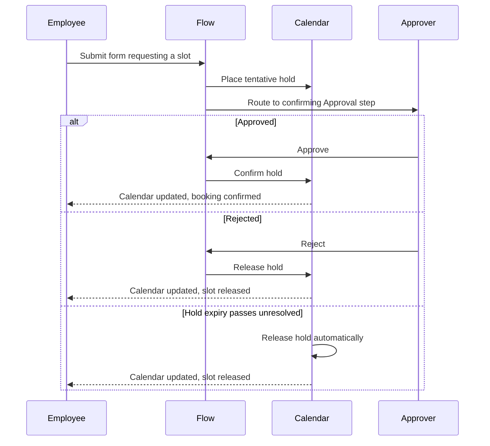

# Communications Calendar

## Purpose

The communications calendar is the shared view of a business line's communication capacity: the channels available to book, the date and time slots each channel offers, and the capacity each slot can hold before it is full. A Book Slot step inside a flow (05-flows.md) places a tentative hold against a slot the moment a run reaches it; the confirming Approval step elsewhere in the same run (06-approvals.md) either turns that hold into a booking or releases it, and an abandoned hold expires on its own (business rule 11). This document defines channels and slots, the Book Slot step, the full booking lifecycle from tentative hold through confirmation, release, and expiry, each channel's overbooking policy, and how the calendar stays visible for planning ahead of submission. See 09-notifications-and-audit.md for the notification and audit entries a booking event produces, and 10-example-processes.md for the marketing campaign request that books push and pop-up slots end to end.

## Personas and the Calendar

| Persona | What they do with the calendar |
|---|---|
| Calendar owner — a Business-Line Admin, or a user holding a custom calendar-management role | Defines channels, slots, capacity, expiry windows, and overbooking policy. |
| Process Designer | Points a Book Slot step at a channel when building a flow. |
| Employee | Picks a channel and date in a form; sees the tentative hold placed on submission. |
| Employee, for example a marketing lead | Views the calendar's confirmed bookings and remaining capacity to plan ahead of submitting. |
| Approver | Confirms or releases held slots by deciding the confirming Approval step. |

## Channels and Slots

A **channel** is a bookable communication surface a business line's requests compete for. The v1 defaults are:

| Channel | What it's used for |
|---|---|
| Push | Push notifications sent through the app. |
| Social | Posts on the business line's social accounts. |
| Pop-up | On-site or in-app pop-up placements. |

This list is not fixed: the calendar owner can add further channels as the business line's communication surfaces grow. Each business line defines its own channels, consistent with tenancy isolation (business rule 1) — a business line never sees or competes for another's capacity.

A **slot** is a date/time window on a channel with a declared **capacity**: the maximum number of held-or-confirmed bookings it can carry at once. The **calendar owner** — a Business-Line Admin, or a user holding a custom role granted the calendar-management capability (see 02-tenancy-and-roles.md) — creates a channel's slots, sets each slot's capacity and expiry window, and sets each channel's overbooking policy.

Every slot carries three settings, each configured by the calendar owner when the slot is created:

| Setting | What it controls |
|---|---|
| Date/time window | Which day, or day and time, the slot represents on the channel. |
| Capacity | The maximum number of held-or-confirmed bookings the slot can carry. |
| Expiry window | How long a tentative hold on the slot can sit undecided before it releases automatically. |

## The Book Slot Step

A Process Designer places a **Book Slot** step inside a flow (05-flows.md) wherever the process needs to reserve communication capacity. Configuring the step only means choosing which channel it targets — the slot itself is not chosen at design time. At run time, the request's own date field determines which slot within that channel the hold lands on, so the same step produces a different slot for every run depending on what the requester entered. A flow can include more than one Book Slot step, one per channel, as the marketing campaign request does (10-example-processes.md), placing a hold for every push or pop-up channel the requester selected.

A Book Slot step never pauses the run waiting for a person; it places its hold immediately and the run continues on to whatever step comes next, most often an Approval step that later confirms or releases the hold it just placed.

## Booking Lifecycle

A booking moves through exactly three states:

- **Tentative** — a hold placed on a slot the moment the run's Book Slot step is reached. It counts against the slot's capacity immediately, so an in-progress request cannot be undercut by a later one racing it for the same slot.
- **Confirmed** — the hold becomes a booking once the run's confirming Approval step is approved. A flow can place several holds — one per selected channel — and have a single Approval step confirm all of them together.
- **Released** — the hold or booking is removed and the slot's capacity frees up. Release happens when the confirming Approval step is rejected, when the underlying node is cancelled, or when a tentative hold's expiry passes unresolved.

A request-changes decision on the confirming Approval step does neither: the run stays waiting at that step (05-flows.md), and the hold stays tentative, still holding its place, until the resubmission is eventually approved, rejected, or the hold expires.

**Expiry** covers the case where neither a rejection nor a cancellation ever happens — an abandoned request whose approver never acts. Every tentative hold carries an expiry window, set per slot by the calendar owner. If the confirming Approval step has not been decided by the time the expiry passes, the hold releases automatically and the slot becomes available again, with no manual cleanup required.

Reading the diagram: submitting the form places the tentative hold before the run reaches the confirming Approval step, so capacity is claimed the instant a request exists. From there exactly one of three outcomes plays out — approval confirms the hold, rejection releases it, or the hold's own expiry releases it unresolved — and each outcome updates the calendar the same way, whether or not a person ever acted.

Every hold, confirmation, and release is written to the node's activity timeline as a Booking entry (09-notifications-and-audit.md), and a confirmed or released booking that affects the requester triggers a notification the same way a decision does.

## Capacity and Overbooking Policy

A slot's capacity is a fixed number set when the slot is created. What happens once that number is reached depends on the channel's **overbooking policy**, set per channel by the calendar owner:

- **Hard block** — once a slot's held-plus-confirmed count reaches capacity, no further hold can be placed on it; a Book Slot step targeting a full slot fails at submission and the requester must choose a different slot.
- **Warn** — a hold can still be placed past capacity, but the requester and the approver see a warning that the slot is over capacity, so they can proceed with it deliberately rather than being blocked outright.

Both policies count tentative holds toward capacity, not only confirmed bookings — a slot fills up as soon as enough requests are in flight, whether or not any of them has been approved yet.

Example: a push slot with capacity 5, three requests already confirmed and one still tentative pending approval.

| Slot | Capacity | Confirmed | Tentative | Remaining | Next booking attempt |
|---|---|---|---|---|---|
| Push, Thursday launch window | 5 | 3 | 1 | 1 | Allowed — one place left before the policy applies. |
| Push, Thursday launch window | 5 | 3 | 2 | 0 | Hard block refuses it; Warn allows it with a warning shown. |

## Calendar Visibility for Planning

The comms calendar is visible before a request is submitted, not just after. Anyone about to start a request that books a slot — an Employee filling in a form, or a marketing lead planning upcoming campaigns — can open the calendar to see each channel's slots, their capacity, and how much of that capacity is already tentative or confirmed. This lets a requester or planner pick a date deliberately rather than discovering a full slot only at submission.

Confirmed bookings and tentative holds are shown separately on the calendar, so a viewer can tell what is already committed from what is still pending a decision. A marketing lead scanning the push channel a month ahead of a launch, for example, can see that two Thursdays are already near capacity and steer a new request toward a third before it is even submitted.

Visibility follows tenancy isolation (business rule 1): a viewer only ever sees their own business line's channels and slots (see 02-tenancy-and-roles.md). The calendar is a read-only planning view for everyone except the calendar owner — only the calendar owner can create channels, add slots, change a slot's capacity or expiry window, or change a channel's overbooking policy.

## User Stories

The stories below cover the calendar owner setting up channels, slots, and policy; a Process Designer wiring a Book Slot step into a flow; an Employee booking and later planning around the calendar; and the confirm/release mechanics the booking lifecycle depends on.

**US-08.1** — As a Business-Line Admin, I want to define my business line's channels, their bookable slots, and each slot's capacity, so that the comms calendar reflects our real booking limits.
- Given I'm in comms calendar settings, I can add a channel and create slots for it, each with a date/time window and a capacity.
- Given I set a slot's expiry window, then any tentative hold placed against it inherits that expiry.
- Channels and slots I define are visible only within my business line, consistent with tenancy isolation (see 02-tenancy-and-roles.md).

**US-08.2** — As a Business-Line Admin, I want each channel's overbooking policy to be hard-block or warn, so that some channels refuse over-capacity bookings while others allow them with a warning.
- Given I'm configuring a channel, I can set its overbooking policy to hard block or warn.
- Given a channel set to hard block, when a Book Slot step targets a slot at capacity, then the booking is refused and the requester must pick a different slot.
- Given a channel set to warn, when a Book Slot step targets a slot at capacity, then the hold is still placed and a warning is shown to the requester and approver.

**US-08.3** — As an Employee, I want to see whether my requested channel and date has open capacity while I'm filling in a form, so that I can pick a slot that's actually available before I submit.
- Given a form with channel and date fields, when I choose channels and a date, then the platform shows which slot each selection lands on and whether it has open capacity.
- Given I submit the form, when the Book Slot step runs, then a tentative hold is placed on each selected channel's slot immediately.
- Given a channel is set to hard block and my chosen slot is already full, then submission is blocked and I'm prompted to choose a different date.

**US-08.4** — As a Process Designer, I want a Book Slot step to place a tentative hold on submission, confirm it on approval, and release it on rejection, cancellation, or abandonment, so that capacity is reserved only for live requests.
- Given a run reaches a Book Slot step, when the step runs, then a tentative hold is placed on the chosen slot immediately.
- Given the run's confirming Approval step is approved, when the decision is recorded, then every tentative hold placed earlier in the run confirms.
- Given the run's confirming Approval step is rejected, the node is cancelled, or a hold's expiry passes unresolved, then the hold releases and the slot's capacity frees up.

**US-08.5** — As an Employee, specifically a marketing lead, I want to see the calendar of confirmed bookings and remaining capacity per channel, so that I can plan upcoming requests without guessing at open slots.
- Given I open the comms calendar, I can see each channel's slots with their confirmed booking counts and remaining capacity.
- Given a slot also carries tentative holds, those counts are shown separately from confirmed bookings.
- The calendar I see is limited to my own business line, consistent with tenancy isolation (see 02-tenancy-and-roles.md).

**US-08.6** — As a Business-Line Admin, I want to see how much of a slot's capacity is already tentative or confirmed before I change that slot's capacity, so that I don't shrink it below what live requests are already relying on.
- Given I open a slot in comms calendar settings, I can see its current capacity alongside its confirmed and tentative counts.
- Given I lower a slot's capacity below its current held-plus-confirmed count, the platform warns me before I save the change.
- Existing holds and bookings on the slot are never removed by a capacity change; the new capacity only applies to bookings placed from then on.

## Out of Scope / Later

- Waitlisting a request when its preferred slot is full is not available; under hard block the requester must pick a different slot, and under warn they proceed with the warning.
- Cross-business-line shared channels or pooled capacity are not supported, the same way holiday calendars are never shared (see 07-tasks-and-deadlines.md).
- Channel utilization and booking-volume reporting is covered under the platform's reporting capability, not here — see 09-notifications-and-audit.md (Phase 5 in 11-roadmap.md).
- Manually moving a confirmed booking to a different slot without cancelling and resubmitting the request is not available in v1.
- A dedicated calendar-owner role name is not introduced; the capability is granted through the Business-Line Admin role or a custom role, per business rule 2 (see 02-tenancy-and-roles.md).
