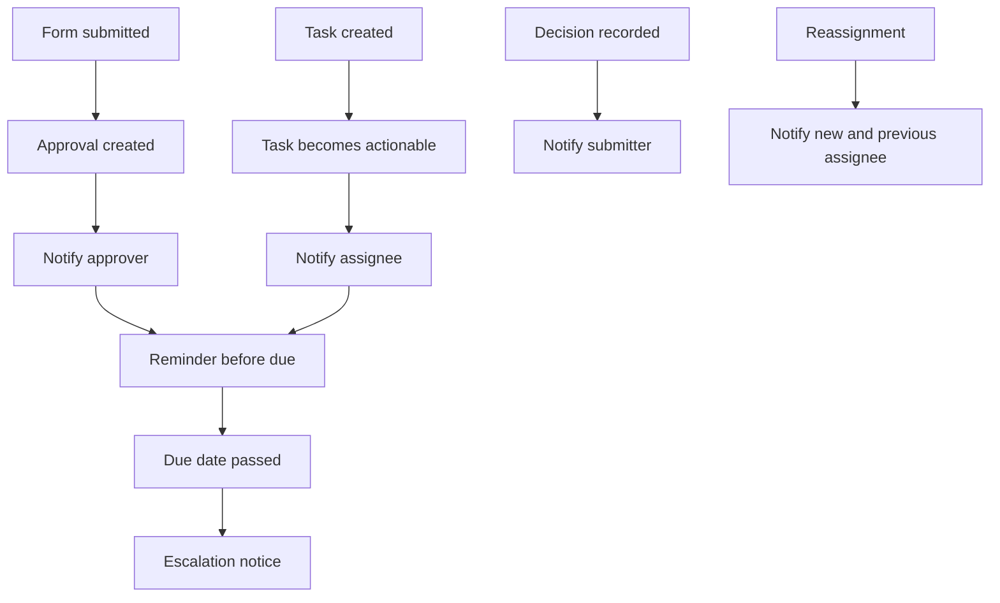

# Notifications, Audit & Reporting

## Purpose

Every approval, task, and node change on the platform must reach the right person without them having to go looking for it, and every action taken must leave a permanent, trustworthy record. This document defines how the platform notifies people in-app and by email, how it escalates work that is going overdue, how the append-only audit timeline on each node captures what happened, and the reporting KPIs that timeline data must be able to answer. See 07-tasks-and-deadlines.md for deadline anchors and offsets, 06-approvals.md for approval modes and decisions, and 08-comms-calendar.md for booking lifecycle events that also feed the audit trail.

## Notification principles

- **Two channels**: every notification is delivered in-app and by email. In-app notifications populate a notification center and update My Work; email is the channel most employees actually watch (business rule 15).
- **Deep links**: every email links straight to the relevant screen — the specific approval decision screen or task detail — never to a generic inbox or homepage. A recipient should be able to act within one click from their inbox.
- **Reminders before due**: tasks and approvals send a reminder a configurable interval before their due date, so work does not go overdue silently. Example: a copywriting task due Thursday can send its reminder on the preceding Tuesday, giving the assignee two business days of notice.
- **Escalation on overdue approvals**: an approval that passes its due date without a decision escalates — notifying the approver again and alerting an escalation contact (for example the approver's manager or a role queue owner), per business rule 6.
- **Batching to avoid noise**: notifications for the same person are grouped where sensible (for example, a daily digest of upcoming due items) instead of firing one email per event when several land close together. Immediate, single-item notifications are reserved for things that need prompt action: a new approval request, an overdue escalation, a request-changes returned to a submitter.
- **Respect activation windows**: a task is not pushed to a person's notifications until it becomes actionable (see 07-tasks-and-deadlines.md), even if it was created earlier.
- **Business-day awareness**: reminder and escalation timers count against the business line's work week (Sunday–Thursday) and holiday calendar, so a due date falling on a Friday does not fire a weekend reminder that goes unread until Sunday.
- **Language**: the words the platform itself writes — subject lines, labels, button text — are rendered in the recipient's own interface language, Arabic or English, with direction to match. Content quoted from the node, such as a field label or an approver's comment, appears exactly as it was written, in the business line's working language (see 00-overview.md).

## Notification content and delivery

- A notification always names the node, the process it belongs to, the reference number (see 03-boards-and-nodes.md), and the action expected of the recipient.
- Approval notifications carry the decision options available (approve, reject, request changes) and any prior comments left on the same approval chain.
- Task notifications carry the due date and, where relevant, the field that anchored it (for example "10 business days before launch date").
- A digest notification lists each item with its own deep link, so a recipient can jump straight to any one item rather than opening a summary screen first.
- Notifications never expose data from a business line other than the recipient's own, consistent with tenancy isolation (see 02-tenancy-and-roles.md).

## What triggers a notification

Notification triggers include: an approval or task is created and becomes actionable; a due date is approaching (reminder); a due date has passed on an approval without a decision (escalation); a decision is recorded on something the submitter is waiting on; a node is reassigned; a request-changes decision returns a node to its submitter; a slot booking is confirmed or released in a way that affects the requester.

### Escalation path

An overdue approval does not just re-notify the same approver. It also alerts an escalation contact so the process does not stall silently:

- **Single or all-of-set approver mode**: the escalation contact is the approver's manager, unless the process defines another contact.
- **Role/team queue**: the escalation contact is the queue owner or the Business-Line Admin for that space.
- **Sequential chain**: escalation applies to whichever approver in the chain currently holds the pending decision; approvers earlier in the chain who already decided are not re-notified.

Escalation notices repeat on the same cadence as reminders until a decision is recorded, so an ignored approval keeps surfacing rather than going quiet after one alert.

## The audit timeline (rule 14)

Every node carries an append-only activity timeline. Entries are never edited or deleted — corrections are new entries, preserving a full history. Each entry records who acted, what they did, and when. The timeline records, at minimum:

| Entry type | What is captured |
|---|---|
| **Submission** | The original form submission that created the node: submitter, submission time, and the values entered. |
| **Decision** | Every approval decision — approve, reject, or request changes — with the decision-maker, timestamp, and the mandatory comment. |
| **Reassignment** | When a task or approval moves from one person to another, who triggered the change, and the reason if one was given. |
| **Edit** | Changes to the node's field values, including edits made while resubmitting after a request-changes decision. |
| **Booking** | Slot hold, confirmation, and release events tied to the node (see 08-comms-calendar.md). |
| **Version used** | Which published version of the form and flow the node's run is operating on, so history stays meaningful even after the definition changes later (see 05-flows.md on versioning). |

For example, a marketing campaign node's timeline might show: submitted Sunday by an Employee; approved Tuesday by their manager with the comment "approved, keep to budget"; a design task reassigned Wednesday from one designer to another; a push-notification slot confirmed Thursday. Anyone opening the node later sees this full sequence in order, with nothing hidden or overwritten.

The timeline is the single place to answer "what happened to this request and who touched it" without reconstructing events from scattered notifications, and it is the underlying data source for all reporting KPIs below.

## Reporting KPIs

The audit data recorded on every node must be able to answer, at minimum:

- **Cycle time per process**: how long nodes of a given process take from submission to completion, and how that trends over time. Derived from the submission entry and the final decision or completion entry on each node.
- **Bottleneck steps**: which flow step (which approval or task) most often accounts for the delay in a slow-running node. Derived by comparing the time between consecutive timeline entries across many nodes of the same process.
- **SLA breaches**: how often due dates are missed, broken down by process, step, and assignee or role. Derived by comparing each step's due date against the timestamp of the entry that closed it.
- **Volumes per process/period**: how many nodes were submitted, approved, rejected, or completed for a process within a given period, to size demand and staffing. Derived by counting submission and decision entries within a date range.

These KPIs are aggregated views over the same timeline entries recorded per node — no separate reporting data is captured; reports are derived from the audit trail. Because every entry carries the version used (see above), KPIs remain comparable even after a form or flow is republished mid-period.

### Example: finance payment request, one month

| KPI | Example figure |
|---|---|
| Nodes submitted | 64 |
| Average cycle time (submission to payment execution) | 4.2 business days |
| Slowest step | Finance manager approval (threshold approvals only) |
| SLA breaches | 7 of 64 (11%) |
| Volume by outcome | 51 approved, 9 rejected, 4 in progress |

A Business-Line Admin reading this would see that threshold approvals are the drag on an otherwise fast process, and could act on it — for example by adjusting the threshold or the approver's reminder timing (see 06-approvals.md).

## Access to the audit timeline and reports

- **Employee and Approver**: can see the full timeline of any node they submitted, are assigned to, or are approving — not nodes belonging to others outside their involvement, unless their role grants broader visibility.
- **Manager or auditor**: a person holding a role with audit visibility (see 02-tenancy-and-roles.md) can see the full timeline of any node in the spaces they are a member of, regardless of personal involvement in the node itself.
- **Business-Line Admin**: sees KPI reporting across all processes and spaces within their business line, plus timelines for any node in it.
- **Platform Admin**: does not see business-line content by default; tenancy isolation applies to audit data the same way it applies to boards and nodes (business rule 1).

## User stories

**US-09.1** — As an Employee, I want to be notified when a decision is made on something I submitted, so that I know whether to proceed, resubmit, or wait.
- Given my submission is approved, rejected, or sent back for changes, I receive an in-app and email notification.
- The email deep-links directly to the node or the decision detail.
- If the decision is request changes, the notification tells me what needs to change.

**US-09.2** — As an Approver, I want to be notified when an approval is waiting on me and reminded before it is due, so that I don't cause a delay.
- I am notified as soon as an approval assigned to me becomes actionable.
- I receive a reminder a set interval before the due date if I haven't decided yet.
- If I let it go overdue, an escalation notice goes out to me and to an escalation contact.

**US-09.3** — As an Employee, I want related notifications batched instead of arriving one at a time, so that my inbox isn't flooded.
- Reminders for items due within the same day are grouped into a single daily digest for the recipient, rather than one email per item.
- Time-sensitive items — a new approval request, an overdue escalation — still arrive immediately, not batched.

**US-09.4** — As an Employee with audit visibility, I want to view a node's full history, so that I can understand exactly what happened and who is accountable.
- I can open any node and see its complete, chronologically ordered activity timeline.
- Every decision entry shows the decision-maker, timestamp, and their comment.
- Reassignments, edits, and bookings all appear in the same timeline, and no entry can be edited or removed.
- The timeline shows which version of the form and flow the node ran on.

**US-09.5** — As a Business-Line Admin, I want to view KPIs across my business line's processes, so that I can identify where work is slow or piling up.
- I can see average and trending cycle time per process.
- I can see which step in a process most often causes delay.
- I can see SLA breach rates and volumes per process over a chosen period.
- Figures reflect only my business line, consistent with tenancy isolation (see 02-tenancy-and-roles.md).

**US-09.6** — As an Employee, I want a notification center that shows what I've already been notified about, so that I don't lose track of items I've seen but not yet acted on.
- All in-app notifications are listed in one place, newest first, alongside their read/unread state.
- Opening a notification takes me straight to the relevant approval or task, matching the destination its email would deep-link to.
- Unread notifications remain visible until I open the item they refer to or explicitly dismiss them.

**US-09.7** — As an Approver, I want the escalation notice to name who else has been alerted, so that I understand the consequence of leaving an approval undecided.
- The escalation notice I receive states that an escalation contact has also been notified.
- The escalation contact's notification names me as the approver who is overdue and states how long the approval has been waiting.
- Once I record a decision, the escalation stops and no further escalation notices are sent for that approval.

**US-09.8** — As a Process Designer, I want to see which step of my flow causes the most delay, so that I can redesign it to move faster.
- I can select one of my processes and see cycle time broken down by step across recent nodes.
- The step with the longest average time-in-step is clearly identified as the bottleneck.
- The breakdown updates as new nodes complete, so I can tell whether a change I made actually helped.

## Out of scope / Later

- Configurable notification preferences (muting specific notification types) are not addressed here.
- Delegation and out-of-office rerouting of notifications is covered under Phase 4 in 11-roadmap.md.
- Dashboard visualizations and export formats for KPIs are an implementation detail of the reporting screens, not defined here.
- Reporting dashboards and the process-improvement loop built on these KPIs are Phase 5 work; this document only defines what the underlying audit data must support (see 11-roadmap.md).
- Real-time push notifications to mobile devices are not assumed in v1; in-app and email are the two channels in scope.
- Exporting the audit timeline or KPI figures to an external file is not defined here; see the rollout principle on spreadsheet export in 11-roadmap.md.
