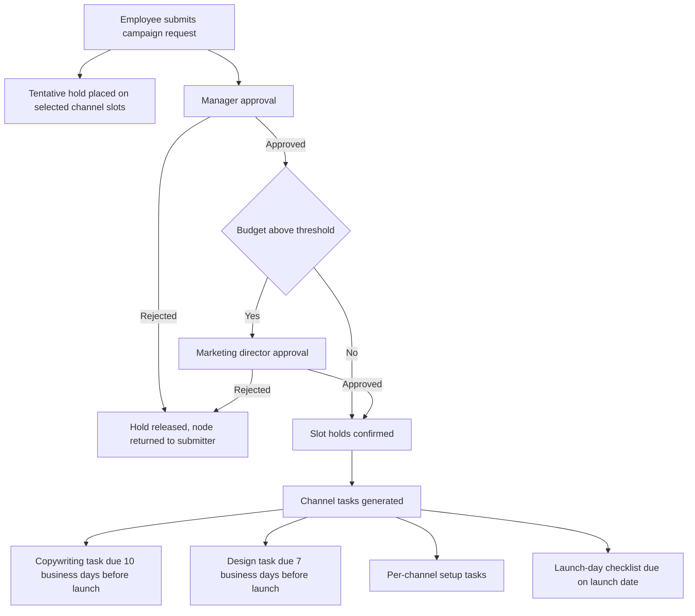
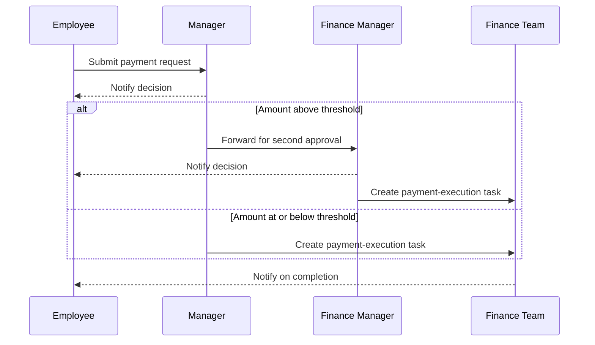
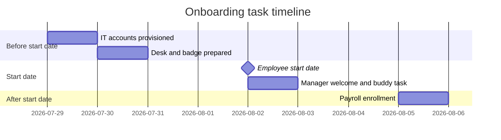

# Example Processes (End-to-End)

## Purpose

This document walks three real WalaPlus processes — marketing campaign requests, finance payment requests, and employee onboarding/offboarding — from form submission through to completion, showing exactly how boards, forms, flows, approvals, tasks, and the comms calendar combine in practice. It exists to ground every abstract rule defined elsewhere in a concrete story; for the mechanics behind each piece, see 04-forms.md, 05-flows.md, 06-approvals.md, 07-tasks-and-deadlines.md, 08-comms-calendar.md, and 09-notifications-and-audit.md.

## How to read these walkthroughs

Each process is presented as: the **form** fields a requester fills in, the **flow** that runs step by step, and what each **persona** experiences along the way. Field types are the 10 canonical types from 03-boards-and-nodes.md and 04-forms.md. Deadlines use the Sunday–Thursday work week and business-day offsets described in 07-tasks-and-deadlines.md. Every submission gets a reference number per 03-boards-and-nodes.md, recorded on the node's audit timeline per 09-notifications-and-audit.md.

## 10.1 Marketing Campaign Request

### Form

| Field | Type |
|---|---|
| Campaign name | Text |
| Launch date | Date |
| Budget | Money |
| Platforms | Multi-select |
| Channels | Multi-select (push, social, pop-up) |
| Campaign owner | Person |
| Brief | File |

Submitting creates a node on the Marketing board and assigns a reference like `MKT-2026-0042`.

### Flow

1. **Trigger** — Campaign Request form submitted.
2. **Book Slot** — for every push or pop-up channel selected, a tentative hold is placed on the matching calendar slot.
3. **Approval** — single approver: the requester's manager.
4. **Condition** — is budget above the campaign spend threshold?
   - Yes → **Approval** — marketing director (second approval, gated by the budget threshold).
   - No → continue directly.
5. On final approval: **Book Slot** holds are confirmed; on any rejection, holds are released and, for a request-changes decision, the node returns to the campaign owner to edit and resubmit.
6. **Task** (generated together once approved): copywriting, due 10 business days before launch date; design, due 7 business days before launch date; one setup task per selected channel, assigned to that channel's role queue; a launch-day checklist, due on the launch date.
7. **Notify** — the campaign owner is notified at submission, at each approval decision, and as each task becomes actionable.

If the launch date is too close for these offsets to be met, submission is blocked or flagged per the infeasible-timeline rule in 07-tasks-and-deadlines.md.

### What each persona experiences

- **Employee** (campaign owner): fills the form, watches the node move through approval on My Work, sees the reference number and slot status change from tentative to confirmed.
- **Approver** (manager, then marketing director if over threshold): the request appears in My Work sorted by due date; they approve, reject with a mandatory comment, or request changes.
- **Process Designer**: configured the threshold, the channel-to-task mapping, and the offsets ahead of time on the board's flow (see 05-flows.md).

### User stories

**US-10.1** As an Employee, I want to submit a campaign request with launch date, budget, platforms, and channels, so that the campaign flow starts without manual handoffs.
- Given all required fields are completed, when I submit, then a node is created with a reference like `MKT-2026-0042`.
- Given I select push or pop-up channels, when I submit, then a tentative hold is placed on the matching slots.
- Given my launch date is too soon for the required task offsets, when I submit, then the platform blocks or warns me.

**US-10.2** As an Approver (manager), I want campaign requests from my team routed to me, so that only viable campaigns proceed.
- Given a request is submitted, when I open it from My Work, then I see the full form and any prior activity.
- Given I approve and budget exceeds the threshold, then the request advances to the marketing director.
- Given I reject, then I must add a comment and the tentative slot hold is released.

**US-10.3** As an Approver (marketing director), I want to see only requests above the budget threshold, so that I focus my review on higher-risk spend.
- Given the manager already approved and budget exceeds the threshold, when I open My Work, then the approval appears assigned to me.
- Given I approve, then slot holds convert to confirmed bookings and channel tasks are generated.

**US-10.4** As an Employee (campaign owner), I want channel tasks and a launch-day checklist created automatically after approval, so that my team knows what to do and when.
- Given the campaign is approved, then copywriting is due 10 business days before launch and design 7 business days before launch.
- Given the launch date, then a launch-day checklist task is due on the launch date itself.
- Given a task's window opens, then it becomes actionable in My Work per 07-tasks-and-deadlines.md.

## 10.2 Finance Payment Request

### Form

| Field | Type |
|---|---|
| Type | Single-select (pay, collect) |
| Amount | Money |
| Beneficiary | Text |
| Cost center | Single-select |
| Invoice | File |

Submitting assigns a reference like `FIN-2026-0107`.

### Flow

1. **Trigger** — Payment Request form submitted.
2. **Approval** — single approver: the requester's manager.
3. **Condition** — is amount above the payment approval threshold?
   - Yes → **Approval** — finance manager, sequential after the manager's decision.
   - No → continue directly.
4. **Task** — on final approval, a payment-execution task is created in the finance team queue, due 3 business days after submission.
5. **Notify** — the requester is notified at submission, at each approval decision, and on execution completion.

A reject at any stage requires a mandatory comment; a request-changes decision returns the node to the requester to edit and resubmit.

### What each persona experiences

- **Employee**: submits the request, tracks it on My Work, gets notified by email with a deep link at each decision.
- **Approver** (manager): decides on every request from their reports regardless of amount.
- **Approver** (finance manager): only sees requests that already cleared manager approval and exceed the threshold, arriving as a second step in the same approval chain.
- **Employee** (finance team): claims the payment-execution task from the team queue and completes it by the due date.

### User stories

**US-10.5** As an Employee, I want to submit a payment or collection request with amount, beneficiary, cost center, and invoice, so that finance can act on it without a spreadsheet.
- Given required fields are completed, when I submit, then a node is created with a reference like `FIN-2026-0107`.
- Given the amount exceeds the threshold, when the manager approves, then a second approval step is added automatically.

**US-10.6** As an Approver (manager), I want to approve or reject payment requests from my team, so that spending under my authority stays controlled.
- Given a request is submitted, when I open it, then I see amount, beneficiary, and invoice.
- Given I reject, then I must add a comment and the requester is notified.
- Given I request changes, then the node returns to the requester to edit and resubmit.

**US-10.7** As an Approver (finance manager), I want to review only requests above the amount threshold, so that large payments get a second, independent review.
- Given the manager has already approved and amount exceeds the threshold, when I open My Work, then the approval is waiting for me.
- Given I approve, then a payment-execution task is created for the finance team queue.

**US-10.8** As an Employee on the finance team, I want a payment-execution task assigned to my queue after final approval, so that I can process it by its due date.
- Given final approval, when the task is created, then it is due 3 business days after submission.
- Given I claim the task from the queue, when I complete it, then the requester is notified and the node's activity timeline records it.

## 10.3 Onboarding / Offboarding

### Form

Two forms share the same field set on the People Operations board.

| Field | Type |
|---|---|
| Employee name | Text |
| Start date (onboarding) or last working day (offboarding) | Date |
| Department | Single-select |
| Manager | Person |

Onboarding submissions get a reference like `ONB-2026-0015`; offboarding submissions get `OFF-2026-0004`.

### Flow

No approval — a pure fan-out of tasks anchored to the date field, all created at submission but surfaced only as each one's window nears (see activation windows in 07-tasks-and-deadlines.md).

**Onboarding**, anchored to start date:
1. **Trigger** — Onboarding Request form submitted.
2. **Task** — IT accounts, assignee: IT role queue, due 2 business days before start date.
3. **Task** — Desk and badge, assignee: facilities role queue, due 1 business day before start date.
4. **Task** — Manager welcome and buddy assignment, assignee: the manager named on the node, due on start date.
5. **Task** — Payroll enrollment, assignee: payroll role queue, due 3 business days after start date.

**Offboarding** mirrors it, anchored to last working day:
1. **Task** — Asset return, due before the last working day.
2. **Task** — Access revocation, assignee: IT role queue, due on the last working day.
3. **Task** — Final settlement, assignee: payroll role queue, due after the last working day.

### What each persona experiences

- **Business-Line Admin** (or manager, depending on granted roles): submits the request the moment a hire is confirmed, often weeks ahead of the start date.
- **Employee** (IT, facilities, payroll role holders): sees nothing on My Work until each task's activation window opens, so inboxes are not flooded weeks early.
- **Employee** (manager): gets the welcome and buddy task on My Work exactly on the start date.
- **Employee** (the new hire): is not a platform user until accounts are provisioned; they experience the outcome, not the flow.

### User stories

**US-10.9** As a Business-Line Admin, I want to submit an onboarding request with start date, department, and manager, so that every preparation task is generated automatically without approval delay.
- Given required fields are completed, when I submit, then all onboarding tasks are created immediately, each with its own due date.
- Given the start date is very close, when I submit, then the platform warns me if any task's offset cannot be met.

**US-10.10** As an Employee (IT role holder), I want an account-provisioning task to appear ahead of a new hire's start date, so that accounts are ready on day one.
- Given the task is due 2 business days before start date, when its activation window opens, then it appears on my My Work.
- Given the task was created weeks earlier, when the window has not opened yet, then it stays hidden from my daily view.

**US-10.11** As an Employee (manager), I want a welcome and buddy-assignment task due on the new hire's start date, so that the new hire is greeted and supported from day one.
- Given the start date arrives, when I open My Work, then the task is due that day.
- Given I complete the task, then it is recorded on the node's activity timeline.

**US-10.12** As a Business-Line Admin, I want offboarding requests to mirror onboarding with tasks anchored before, on, and after the last working day, so that access and settlement happen on schedule.
- Given a last working day is set, when I submit, then asset return is due before it, access revocation on it, and final settlement after it.
- Given access revocation is due on the last working day, then it is not delayed by any approval step.

## Out of scope / Later

- Multi-currency budgets and payment amounts.
- Campaign performance tracking after launch (post-launch reporting is covered under Phase 5 in 11-roadmap.md).
- Automated re-routing when a named approver or role queue is empty (see delegation and escalation, planned in 11-roadmap.md Phase 4).
- Per-reader translation of these forms. Each is authored once in its business line's working language, so the English field labels shown above are illustrative — an Arabic-working business line would author the same forms in Arabic (see 00-overview.md).
